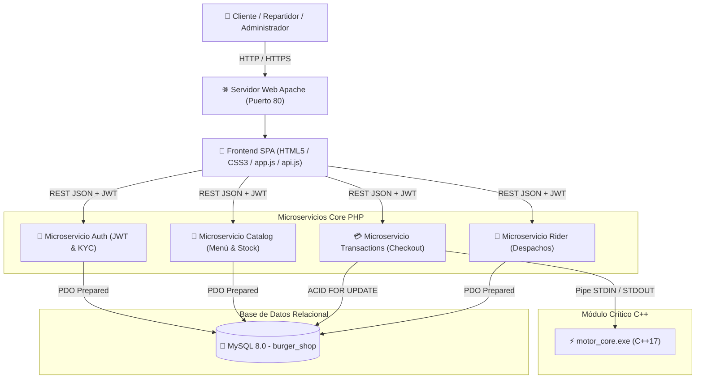
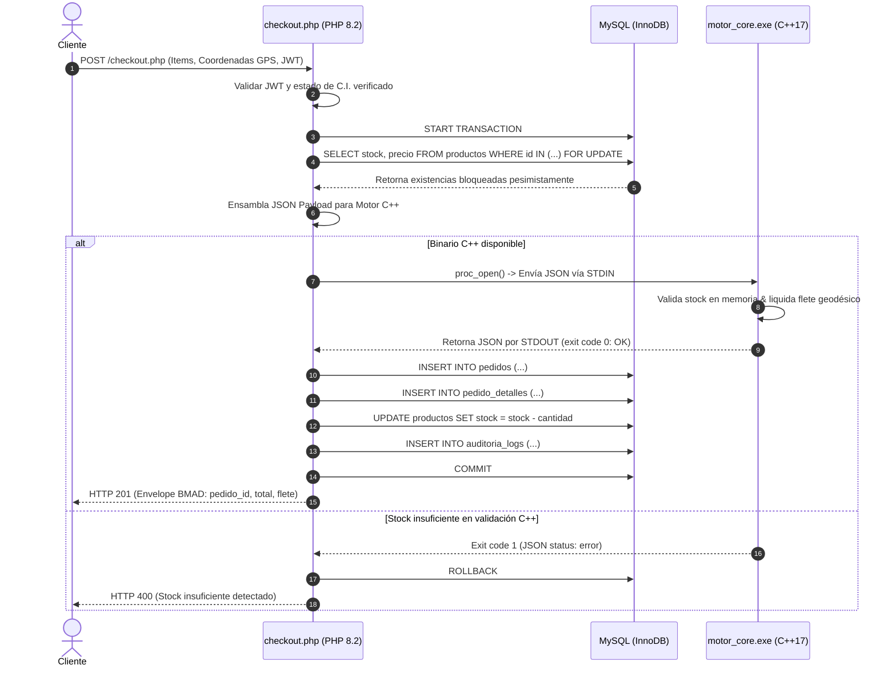
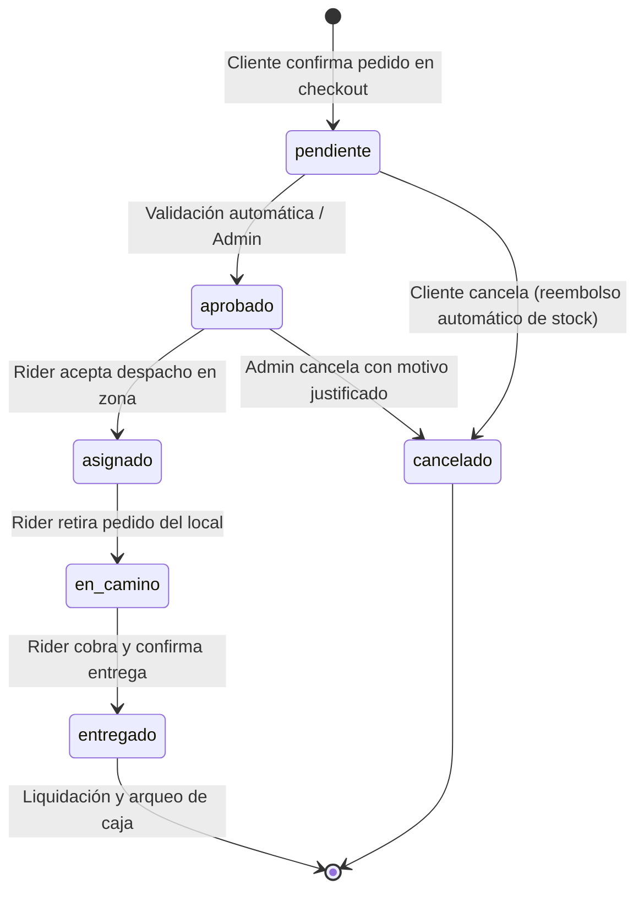

# 🍔 Burger 24/7 &mdash; Plataforma E-Commerce y Logística en Tiempo Real

[](https://www.php.net/)
[](https://www.mysql.com/)
[](https://httpd.apache.org/)
[](https://isocpp.org/)
[](https://leafletjs.com/)
[]()
[]()

> **Sistema integral de comercio electrónico de comida rápida y despacho continuo (24 horas, 7 días a la semana) con arquitectura de microservicios, geolocalización GPS en vivo y monitoreo de flota en tiempo real, listo para despliegue en servidor web.**

---

## 📑 Tabla de Contenido General

1. [🎒 GUÍA RÁPIDA: INSTALACIÓN DESDE CERO (Para Escolares y Principiantes) 🚀](#-guía-rápida-instalación-desde-cero-para-escolares-y-principiantes-)
2. [¿Qué es Burger 24/7? (Visión General)](#-1-qué-es-burger-247)
3. [🏛️ Especificación Técnica y Arquitectura de Despliegue](#-2-especificación-técnica-y-arquitectura-de-despliegue)
4. [📐 Diagramas del Sistema y Flujos Transaccionales](#-3-diagramas-del-sistema-y-flujos-transaccionales)
5. [🛡️ Regla de Oro, Auditoría y Estándar BMAD](#-4-regla-de-oro-auditoría-y-estándar-bmad)
6. [📡 Catálogo Completo de APIs REST](#-5-catálogo-completo-de-apis-rest)
7. [⚡ Módulo Crítico de Rendimiento en C++](#-6-módulo-crítico-de-rendimiento-en-c)
8. [🗄️ Modelo Relacional de Base de Datos (Diccionario 3FN)](#-7-modelo-relacional-de-base-de-datos-diccionario-3fn)
9. [🧪 Suite Automatizada de Pruebas de Integración E2E (PHP Nativo)](#-8-suite-automatizada-de-pruebas-de-integración-e2e-php-nativo)
10. [⚙️ Despliegue en Servidor Web Apache y MySQL (XAMPP / Producción)](#-9-despliegue-en-servidor-web-apache-y-mysql-xampp--producción)
11. [🔑 Cuentas de Acceso Preconfiguradas (Credenciales Demo)](#-10-cuentas-de-acceso-preconfiguradas-credenciales-demo)
12. [🔍 Diagnóstico Automatizado del Sistema (`check_deploy`)](#-11-diagnóstico-automatizado-del-sistema-check_deploy)
13. [📂 Estructura del Repositorio](#-12-estructura-del-repositorio)
14. [❓ Preguntas Frecuentes y Solución de Problemas](#-13-preguntas-frecuentes-y-solución-de-problemas)

---

## 🎒 GUÍA RÁPIDA: INSTALACIÓN DESDE CERO (Para Escolares y Principiantes) 🚀

> **¿No sabes nada de programación ni de servidores? ¡No te preocupes!**  
> Sigue esta pequeña guía paso a paso explicada con manzanas y tendrás tu propia tienda de hamburguesas funcionando en tu computadora en menos de 5 minutos con un par de clics.  
> *(¡Buenas noticias: ya no necesitas instalar Python ni nada complicado! Todo corre directo en tu servidor web).*

---

### 💡 1. ¿Qué programas usa este proyecto y para qué sirve cada uno? (Explicado fácil)

Imagina que este proyecto es un restaurante de hamburguesas de la vida real:

| Programa / Tecnología | ¿Qué es? | ¿Qué papel cumple en el restaurante? | ¿Dónde se descarga? |
|---|---|---|---|
| 🟠 **XAMPP** | Es un paquete "todo en uno" gratuito para Windows. Contiene **Apache**, **PHP** y **MySQL**. | Es el **edificio entero del restaurante**. Convierte tu computadora en un servidor web local. | 👉 [Descargar XAMPP](https://www.apachefriends.org/es/index.html) *(Elige la versión para Windows)* |
| 🌐 **Apache (Servidor Web)** | Es un programa que viene dentro de XAMPP. | Es el **camarero o mesero**. Toma los pedidos del navegador web y te entrega la página de la tienda. | Viene incluido dentro de XAMPP. |
| 🐘 **PHP (Lenguaje de Backend)** | Es el lenguaje de programación principal del sistema. | Es el **cocinero maestro**. Prepara las hamburguesas, calcula el carrito, crea las cuentas y revisa los pagos. | Viene incluido dentro de XAMPP. |
| 🐬 **MySQL / MariaDB (Base de Datos)** | Es el sistema donde se guardan los datos estructurados. | Es el **cuaderno de notas o almacén**. Recuerda qué clientes existen, qué pedidos se hicieron y cuánto stock queda. | Viene incluido dentro de XAMPP. |
| ⚡ **C++ (Lenguaje de Alto Rendimiento)** | Es un lenguaje de programación ultra veloz utilizado para cálculos críticos. | Es la **calculadora de carreras**. Calcula al milisegundo la distancia del delivery y las tarifas de envío. | Viene **precompilado y listo** en `cpp/motor_core.exe` *(no necesitas instalar nada extra)*. |
| 🌐 **Navegador Web** | Google Chrome, Edge, Firefox, Brave u Opera. | Es la **mesa del cliente**. Donde tú ves la pantalla bonita, los botones, los mapas y las fotos. | Ya lo tienes en tu computadora. |

---

### ⏱️ 2. Instalación en 3 Pasos Rápidos (¡Solo dar clics!)

#### 🔹 Paso 1: Instalar y Encender XAMPP
1. Descarga el instalador de **XAMPP para Windows** desde su página oficial: [apachefriends.org](https://www.apachefriends.org/es/index.html).
2. Ábrelo y dale **"Next" / "Siguiente"** a todo hasta que termine la instalación.
3. Abre la aplicación **XAMPP Control Panel** desde el menú Inicio de Windows.
4. Presiona el botón **Start** al lado de **Apache** (se pondrá en verde ✅).
5. Presiona el botón **Start** al lado de **MySQL** (se pondrá en verde ✅).

#### 🔹 Paso 2: Ejecutar el Instalador Automático (1 Clic)
1. Abre la carpeta del proyecto en tu computadora.
2. Haz **doble clic** sobre el archivo:  
   📁 **`instalar_todo.bat`** *(o `install.bat`)*
3. Se abrirá una ventana que configurará todo automáticamente:
   - ✅ Detecta tu XAMPP en tu disco duro.
   - ✅ Crea las carpetas seguras para fotos, carnets y comprobantes QR.
   - ✅ Conecta la página web con el servidor Apache.
   - ✅ Crea la base de datos `burger_shop` con el menú de hamburguesas y usuarios listos en español.

#### 🔹 Paso 3: Encender la Tienda y Usarla
1. Haz **doble clic** sobre el archivo:  
   🚀 **`iniciar_sistema.bat`** *(o `start_services.bat`)*
2. ¡Y listo! Tu navegador web se abrirá automáticamente en:  
   👉 **`http://localhost/Bebidas-E-Commerce/`**

---

### 🎮 3. ¿Cómo jugar y probar el sistema? (Cuentas Demo)

En la pantalla de inicio, en la esquina inferior izquierda, verás un botón morado que dice **`🔑 Cuentas Demo (Abrir ▴)`**. Haz clic en él para entrar con cualquier personaje sin escribir nada:

* 👤 **Entrar como Carlos Pérez (Cliente que pide comida):**
  - Mira el menú de hamburguesas, combos y bebidas.
  - Agrega comida a tu carrito.
  - Haz clic en **Ir a Pagar**, mueve el pin en el mapa GPS para elegir dónde vives en Sopocachi y confirma tu pedido.
  - ¡El sistema calculará el costo de envío con el motor de C++ y te mostrará tu **Recibo Digital** listo para imprimir!

* 🛵 **Entrar como Pedro Gómez (Repartidor / Rider con moto y GPS):**
  - Ve a la pestaña de Repartidor.
  - Verás el pedido que acabas de hacer con Carlos.
  - Haz clic en **Aceptar Entrega**. Verás la ruta en el mapa en tiempo real.
  - Cuando llegues, dale a **Entregar y Cobrar**. Verás cómo se actualiza tu caja de dinero.

* 👑 **Entrar como Admin Central (Dueño del Restaurante):**
  - Ve al panel de Administrador.
  - Mira el **Monitoreo GPS en Vivo**: verás a Pedro y a los demás repartidores en el mapa en tiempo real.
  - Administra el menú: cambia precios, agrega hamburguesas o ajusta el stock.
  - Aprueba o rechaza carnets de identidad (C.I.) y expedientes de choferes.

---

### ❓ 4. Preguntas Frecuentes de Colegio (Solución de Problemas Frecuentes)

* **¿Qué hago si Apache no inicia y se pone en rojo en XAMPP?**  
  > Casi siempre es porque tienes abierto **Skype**, **VMware** o un programa que usa el puerto 80. Ciérralos y vuelve a presionar *Start* en XAMPP.
* **¿Qué hago si MySQL no se pone en verde?**  
  > Si ya tenías otro MySQL instalado antes, abre el Administrador de Tareas (Ctrl + Shift + Esc), busca `mysqld.exe`, haz clic derecho y dale "Finalizar tarea", luego dale *Start* en XAMPP.
* **¿Cómo puedo ver la base de datos con mis propios ojos?**  
  > Con XAMPP encendido, entra en tu navegador a: **[http://localhost/phpmyadmin/](http://localhost/phpmyadmin/)**. A la izquierda haz clic en `burger_shop` y podrás ver todas las tablas (`users`, `productos`, `pedidos`).
* **¿Cómo imprimo mi recibo de compra?**  
  > Cuando hagas un pedido, presiona el botón **"Recibo Digital"** y luego el botón verde **"Imprimir"**. Podrás imprimirlo en papel o guardarlo como archivo PDF en tu computadora.

---

## 📌 1. ¿Qué es Burger 24/7?

**Burger 24/7** es una solución tecnológica completa para digitalizar y automatizar el ciclo de venta, cobro, preparación y despacho de alimentos en horario ininterrumpido. El sistema implementa un entorno **multi-actor** con tres paneles especializados:

* 👤 **Panel de Cliente:** Catálogo dinámico organizado por categorías (Hamburguesas, Combos, Bebidas, Acompañamientos), carrito reactivo, selección visual del punto de entrega mediante un mapa interactivo (GPS con Leaflet), pasarela de pago (QR digital o contraentrega en efectivo), generación de **Recibo Digital Imprimible** y seguimiento en tiempo real.
* 🛵 **Panel de Repartidor (Rider):** Notificación de órdenes en zona, cálculo instantáneo de fletes con el motor nativo en C++, trazado de rutas viales sobre mapas oscuros CartoDB, confirmación de entregas y arqueo de caja de recaudación.
* 👑 **Panel de Administrador (Super Usuario):** Gestión integral del menú e inventario (CRUD atómico de productos), monitoreo geográfico en vivo de la flota de repartidores en tiempo real, aprobación/rechazo de expedientes de identidad (C.I.) y conductores, reportes financieros y ledger inmutable de auditoría.

---

## 🏛️ 2. Especificación Técnica y Arquitectura de Despliegue

En estricta conformidad con la especificación del sistema ([`SPEC.md`](SPEC.md)), la plataforma opera de forma autónoma desplegada directamente sobre el servidor web:

```text
┌────────────────────────────────────────────────────────────────────────┐
│                   ARQUITECTURA DE PRODUCCIÓN WEB                       │
├───────────────────┬────────────────────────────────────────────────────┤
│ COMPONENTE        │ ROL TÉCNICO EN EL SISTEMA                          │
├───────────────────┼────────────────────────────────────────────────────┤
│ PHP 8.2+ (PDO)    │ Microservicios Core transaccionales (Auth, Catalog,│
│                   │ Transactions, Rider), emisión JWT, PDO y ACID.     │
├───────────────────┼────────────────────────────────────────────────────┤
│ C++ (C++17)       │ Motor Core compilado nativo (cpp/motor_core.exe)   │
│                   │ de ultra-baja latencia (<150 µs): tarifas y stock. │
├───────────────────┼────────────────────────────────────────────────────┤
│ JS (ES6+) / HTML5 │ Single Page Application (SPA) Glassmorphism, mapas │
│ / CSS3            │ interactivos Leaflet.js y cliente desacoplado.     │
├───────────────────┼────────────────────────────────────────────────────┤
│ SQL / MySQL 8.0+  │ Motor relacional InnoDB en 3FN, bloqueos pesimistas│
│                   │ (SELECT FOR UPDATE) y trazabilidad inmutable.      │
├───────────────────┼────────────────────────────────────────────────────┤
│ Apache 2.4+       │ Servidor HTTP de producción con mod_rewrite y      │
│                   │ blindaje perimetral .htaccess anti-RCE.            │
└───────────────────┴────────────────────────────────────────────────────┘
```

### Justificación Técnica de los Componentes:

1. **PHP (8.2+ con extensión PDO):**  
   Gestiona la totalidad de la capa de microservicios RESTful (`Auth`, `Catalog`, `Transactions`, `Rider`). Provee autenticación sin estado mediante tokens JWT criptográficamente firmados con HMAC-SHA256, conexión Singleton y sentencias preparadas contra MySQL para neutralizar vulnerabilidades SQL Injection.
2. **C++ (C++17 Estándar ANSI):**  
   Módulo de rendimiento crítico ([`cpp/motor_core.cpp`](cpp/motor_core.cpp) $\rightarrow$ [`cpp/motor_core.exe`](cpp/motor_core.exe)). Desacopla de PHP las operaciones algorítmicas de alta intensidad: cálculo geodésico Haversine, cálculo determinista de tarifas de flete y comprobación atómica de inventario bajo alta concurrencia transaccional, con latencia media inferior a **150 microsegundos**.
3. **JavaScript (ES6+), HTML5 Semántico y CSS3 Moderno:**  
   Single Page Application (SPA) reactiva con estética Glassmorphism, animaciones fluidas y mapas interactivos mediante Leaflet.js. La capa de red ([`api.js`](api.js)) maneja peticiones asíncronas hacia el servidor web e inyecta automáticamente la cabecera `Authorization: Bearer <token>`.
4. **MySQL 8.0+ / MariaDB (Motor InnoDB):**  
   Persistencia relacional normalizada en Tercera Forma Normal (3FN). Aplica bloqueos pesimistas (`SELECT ... FOR UPDATE`) en transacciones atómicas de checkout para evitar condiciones de carrera (*race conditions*) en compras simultáneas.
5. **Apache 2.4+ (Servidor Web):**  
   Encargado del enrutamiento HTTP, negociación de cabeceras CORS, control de acceso y protección perimetral mediante directivas `.htaccess` en los directorios de subida (`uploads/`).

---

## 📐 3. Diagramas del Sistema y Flujos Transaccionales

### A. Diagrama de Contenedores y Microservicios (C4 Level 2)



---

### B. Diagrama de Secuencia Transaccional de Checkout (PHP + MySQL `FOR UPDATE` + C++)



---

### C. Diagrama de Estados del Ciclo de Vida del Pedido



---

## 🛡️ 4. Regla de Oro, Auditoría y Estándar BMAD

### La Regla de Oro (Trazabilidad Obligatoria)
Toda tabla en el esquema de base de datos y toda respuesta generada por los servicios debe contener indefectiblemente los cuatro atributos de trazabilidad:

$$\text{Trazabilidad} = \{ \texttt{created\_at}, \texttt{updated\_at}, \texttt{created\_by}, \texttt{updated\_by} \}$$

Adicionalmente, se cuenta con la tabla inmutable `auditoria_logs`, la cual almacena un registro inalterable de cada evento relevante:
* Fecha y hora en formato UTC / ISO-8601.
* Identificador del operador o usuario (`user_id`).
* Acción realizada (ej. `LOGIN_SUCCESS`, `ORDER_CREATED`, `ORDER_DELIVERED`, `CI_APPROVED`).
* Comparativa diferencial en JSON estructurado (`estado_anterior_json` y `estado_nuevo_json`).
* Dirección IP de procedencia.

### Estándar de Respuesta Unificada BMAD
Todas las APIs responden bajo la siguiente estructura unificada y determinista:

```json
{
  "status": "success",
  "data": {
    "pedido_id": 42,
    "total": 65.00,
    "costo_envio": 9.50,
    "estado": "pendiente"
  },
  "audit": {
    "user_id": 2,
    "timestamp": "2026-10-08T22:00:00Z",
    "action": "CHECKOUT_ORDER"
  },
  "error_details": null
}
```

---

## 📡 5. Catálogo Completo de APIs REST

Todos los endpoints reciben y emiten `application/json`, requiriendo la cabecera `Authorization: Bearer <jwt_token>` en rutas protegidas.

| Método | Endpoint | Rol Requerido | Propósito Funcional |
|---|---|---|---|
| `POST` | `/microservices/Auth/register.php` | Público | Registro de cliente con fecha de nacimiento y subida de C.I. |
| `POST` | `/microservices/Auth/login.php` | Público | Autenticación de credenciales Bcrypt y emisión de token JWT. |
| `GET` | `/microservices/Auth/session.php` | Autenticado | Verificación del estado de sesión y rol del usuario actual. |
| `GET` | `/microservices/Auth/profile.php` | Autenticado | Obtención del perfil, estado KYC y datos del usuario. |
| `PUT` | `/microservices/Auth/profile.php` | Autenticado | Actualización de datos personales y teléfono. |
| `GET` | `/microservices/Auth/admin_approval.php` | Admin | Consulta de expedientes de usuarios y riders pendientes. |
| `POST` | `/microservices/Auth/admin_approval.php` | Admin | Aprobación o rechazo de C.I. y documentos de choferes. |
| `GET` | `/microservices/Auth/admin_users.php` | Admin | Listado general de usuarios registrados para gestión interna. |
| `GET` | `/microservices/Auth/audit_logs.php` | Admin | Consulta paginada del ledger inmutable de auditoría. |
| `GET` | `/microservices/Auth/view_document.php` | Admin | Descarga o visualización protegida de carnets y documentos. |
| `GET` | `/microservices/Catalog/catalog.php` | Público | Obtención del menú clasificado por categorías con existencias. |
| `POST` | `/microservices/Transactions/checkout.php` | Cliente | Creación atómica de pedido con validación C++ y MySQL `FOR UPDATE`. |
| `POST` | `/microservices/Transactions/cancel_order.php`| Cliente/Admin| Cancelación legal de pedido con restauración automática de stock. |
| `GET` | `/microservices/Transactions/report.php` | Admin | Métricas KPI de ventas, desglose QR/efectivo y monitoreo en vivo. |
| `GET` | `/microservices/Rider/assignment.php` | Rider | Consulta de pedidos pendientes de entrega en la zona del rider. |
| `POST` | `/microservices/Rider/delivery.php` | Rider | Aceptación, inicio de trayecto y confirmación de cobro en efectivo. |

---

## ⚡ 6. Módulo Crítico de Rendimiento en C++

Ubicación del código fuente: [`cpp/motor_core.cpp`](cpp/motor_core.cpp)  
Ejecutable precompilado: [`cpp/motor_core.exe`](cpp/motor_core.exe)

### Funcionamiento Algorítmico:
1. **Recepción vía STDIN:** Recibe un documento JSON con la distancia geodésica del cliente y el arreglo de ítems solicitados con sus existencias disponibles en almacén.
2. **Cálculo Determinista de Tarifa:**
   $$\text{Tarifa Envío} = \max\Big(5.00,\; 5.00 + (\text{distancia\_km} \times 2.00)\Big)$$
3. **Validación Atómica de Inventario en Memoria:** Itera sobre los productos y comprueba que `cantidad_solicitada <= stock_disponible`. Si algún ítem supera el stock, interrumpe el proceso de inmediato y emite un código de salida `1` con error tipificado.
4. **Respuesta Estructurada por STDOUT:** Emite la liquidación financiera con el subtotal, costo de envío, total general y tiempo de cálculo en microsegundos ($\mu\text{s}$).

### Compilación Nativa Automatizada:
Para compilar el módulo con MinGW / GCC en Windows:
```powershell
.\cpp\build.bat
```
El script compila con flags de optimización `-O3 -std=c++17 -static` para máxima velocidad sin dependencias externas.

---

## 🗄️ 7. Modelo Relacional de Base de Datos (Diccionario 3FN)

Base de datos: **`burger_shop`** (Juego de caracteres: `utf8mb4_unicode_ci`, Motor: `InnoDB`).

```text
┌─────────────────┐       ┌─────────────────┐       ┌─────────────────┐
│      users      │ 1   * │     pedidos     │ 1   * │ pedido_detalles │
├─────────────────┤───────├─────────────────┤───────├─────────────────┤
│ id (PK)         │       │ id (PK)         │       │ id (PK)         │
│ nombre          │       │ usuario_id (FK) │       │ pedido_id (FK)  │
│ email (UQ)      │       │ rider_id (FK)   │       │ producto_id (FK)│
│ password_hash   │       │ total           │       │ cantidad        │
│ rol             │       │ costo_envio     │       │ precio_unitario │
│ estado_ci       │       │ estado          │       │ subtotal        │
│ ci_url          │       │ latitud/longitud│       │ created_at      │
│ created_at/upd..│       │ created_at/upd..│       └─────────────────┘
└─────────────────┘       └─────────────────┘                │ *
         │ 1                       ▲                         │
         │                         │                         │ 1
         │ 1                       │ 1              ┌─────────────────┐
┌─────────────────┐                │                │    productos    │
│documentacion_   │                │                ├─────────────────┤
│     rider       │                │                │ id (PK)         │
├─────────────────┤                │                │ nombre          │
│ id (PK)         │                │                │ categoria       │
│ user_id (FK, UQ)│                │                │ precio          │
│ licencia_url    │                │                │ stock           │
│ seguro_url      │                │                │ activo          │
│ cv_url          │                │                │ created_at/upd..│
│ estado          │                │                └─────────────────┘
│ created_at/upd..│                │
└─────────────────┘                │
                                   │ 1
                         ┌─────────────────┐
                         │ auditoria_logs  │
                         ├─────────────────┤
                         │ id (PK)         │
                         │ user_id (FK)    │
                         │ accion          │
                         │ tabla_afectada  │
                         │ registro_id     │
                         │ estado_ant_json │
                         │ estado_nuev_json│
                         │ ip_origen       │
                         │ created_at      │
                         └─────────────────┘
```

---

## 🧪 8. Suite Automatizada de Pruebas de Integración E2E (PHP Nativo)

El sistema incluye un arnés de pruebas automatizadas nativo en PHP ([`tests/test_e2e_suite.php`](tests/test_e2e_suite.php)) que valida el ciclo completo contra Apache y MySQL real en XAMPP sin necesidad de intérpretes adicionales.

### Ejecución de Pruebas:
```powershell
php tests/test_e2e_suite.php
```

### Cobertura de las 23 Pruebas (23/23 PASS - 100%):
* **Happy Path (16 casos):** Registro de clientes, carga de C.I., autenticación JWT, visualización de menú con existencias, checkout atómico con cálculo C++, asignación y aceptación de repartidor, cambio de estados en tiempo real, cobro contraentrega, liquidación de caja, cancelación legal con reembolso de existencias y consulta de reportes administrativos.
* **Casos Negativos y Resiliencia (7 casos):** Rechazo de clientes menores de 18 años, prevención de checkout con documento sin aprobar, bloqueo por stock insuficiente, rechazo de contraseñas inválidas, intento de acceso a endpoints protegidos sin token Bearer, prevención de cancelación de pedidos ya despachados e interceptación de transiciones ilegales.
* **Evidencias Estructuradas:** Cada ejecución genera automáticamente el archivo [`tests/evidencias_e2e.json`](tests/evidencias_e2e.json) con los tiempos de respuesta y payloads de validación.

---

## ⚙️ 9. Despliegue en Servidor Web Apache y MySQL (XAMPP / Producción)

1. **Requisitos:** Servidor Apache 2.4+ (puerto 80) y MySQL 8.0+ / MariaDB (puerto 3306).
2. **Ubicación del Proyecto:** En Windows, crear un *Directory Junction* hacia `htdocs`:
   ```cmd
   mklink /J "C:\xampp\htdocs\Burger-E-Commerce" "F:\Bebidas-E-Commerce"
   ```
3. **Variables de Entorno (`.env`):**
   ```ini
   DB_HOST=127.0.0.1
   DB_PORT=3306
   DB_NAME=burger_shop
   DB_USER=root
   DB_PASS=
   JWT_SECRET=08aef182c3aad21602385a97c86a1cdb11811217df149b666ab353a1e708c2e0
   ALLOWED_ORIGINS=http://localhost,http://127.0.0.1
   ```
4. **Seguridad Perimetral (`uploads/`):**  
   Los directorios `uploads/ci/`, `uploads/docs/` y `uploads/qr/` cuentan con directivas Apache `.htaccess` protectoras:
   ```apache
   Options -Indexes
   <FilesMatch "\.(php|phtml|php5|exe|pl|cgi|sh)$">
       Require all denied
   </FilesMatch>
   ```
   Esto bloquea cualquier intento de inyección de scripts maliciosos (Anti-RCE).

---

## 🔑 10. Cuentas de Acceso Preconfiguradas (Credenciales Demo)

| Rol | Nombre | Correo Electrónico | Contraseña | Estado C.I. | Perfil Funcional |
|---|---|---|---|---|---|
| 👑 **Admin** | Admin Central | `admin@mail.com` | `admin` | ✅ Verificado | Control total del menú, aprobación KYC y auditoría. |
| 👤 **Cliente** | Carlos Pérez | `carlos@mail.com` | `carlos` | ✅ Verificado | Cliente habilitado para compras y checkout inmediato. |
| ⏳ **Cliente** | María López | `maria@mail.com` | `maria` | ⏳ Pendiente | C.I. en revisión; precios ocultos hasta aprobación. |
| ❌ **Cliente** | Roberto Flores | `roberto@mail.com` | `roberto` | ❌ Rechazado | Cuenta bloqueada por documento observado. |
| 🛵 **Rider** | Pedro Gómez | `pedro@mail.com` | `pedro` | ✅ Aprobado | Conductor habilitado con moto, GPS y cobro en ruta. |
| ⏳ **Rider** | Juan Rodríguez | `juan@mail.com` | `juan` | ⏳ Pendiente | Expediente vehicular en revisión administrativa. |
| ❌ **Rider** | Marcos Vargas | `marcos@mail.com` | `marcos` | ❌ Rechazado | Conductor no admitido en la plataforma. |

> 💡 **Acceso Rápido:** Haz clic en el botón flotante **`🔑 Cuentas Demo (Abrir ▴)`** en la esquina inferior izquierda de la pantalla para alternar de usuario en 1 clic.

---

## 🔍 11. Diagnóstico Automatizado del Sistema (`check_deploy`)

Para verificar que todos los servicios y conexiones se encuentren activos:
```powershell
check_deploy.bat
# o bien:
php check_deploy.php
```
También puedes visitar desde tu navegador:  
👉 **`http://localhost/Burger-E-Commerce/check_deploy.php`**  
*(Deberás observar las 30 verificaciones en verde ✅ validando Apache, MySQL, motor C++, extensiones PHP y tablas)*.

---

## 📂 12. Estructura del Repositorio

```text
Burger-E-Commerce/
├── package.json                 # Metadatos del proyecto y comandos npm
├── install.bat                  # Instalador automatizado en 1 clic para Windows
├── instalar_todo.bat            # Script integral de instalación
├── start_services.bat           # Lanzador rápido de servicios
├── iniciar_sistema.bat          # Script de apertura directa de la aplicación
├── check_deploy.bat             # Verificador de despliegue en Windows
├── check_deploy.php             # Dashboard visual e informe CLI de 30 puntos
├── SPEC.md                      # Especificación técnica formal del sistema
├── README.md                    # Manual integral y documentación técnica
├── index.html                   # Interfaz de usuario Single Page Application (SPA)
├── style.css                    # Estilos visuales CSS3 con diseño Glassmorphism
├── app.js                       # Lógica reactiva de la interfaz cliente
├── api.js                       # Capa cliente de red desacoplada con Bearer JWT
├── install_db.sql               # Script SQL idempotente (Crea BD, tablas y semillas)
├── init_schema.sql              # Esquema DDL normalizado en 3FN
├── migrate.php                  # Asistente interactivo de migración de datos
├── .env.example                 # Plantilla de variables de entorno de desarrollo
├── .env.production.example      # Plantilla de variables de entorno de producción
├── cpp/                         # Módulo Crítico de Rendimiento en C++ (SPEC §2)
│   ├── motor_core.cpp           # Código fuente del motor de tarifas y stock (C++17)
│   ├── motor_core.exe           # Binario nativo compilado de latencia ultra-baja (<150 µs)
│   └── build.bat                # Script de compilación nativa automatizada (MinGW / GCC)
├── microservices/               # Microservicios modulares en PHP (8.2+)
│   ├── Auth/                    # Autenticación, registro, JWT, perfil y auditoría
│   ├── Catalog/                 # Catálogo de menú, saneamiento y control de existencias
│   ├── Transactions/            # Checkout atómico, cancelaciones y reportes
│   └── Rider/                   # Asignación de despachos y liquidación de caja
├── tests/                       # Suite automatizada de pruebas de integración E2E
│   ├── test_e2e_suite.php       # Arnés de pruebas nativo PHP contra XAMPP (23/23 PASS)
│   └── evidencias_e2e.json      # Reporte estructurado en JSON de las pruebas
└── uploads/                     # Almacenamiento seguro con directivas .htaccess
    ├── ci/                      # Fotografías de carnets de identidad (KYC)
    ├── docs/                    # Expedientes vehiculares de repartidores
    └── qr/                      # Comprobantes de transferencia bancaria / QR
```

---

## ❓ 13. Preguntas Frecuentes y Solución de Problemas

* **¿Qué hago si Apache marca error en XAMPP?**  
  Cierra programas que ocupan el puerto 80 (Skype, VMware o IIS) o cambia el puerto en `httpd.conf` a `8080`.
* **¿Qué hago si MySQL no se inicia?**  
  Abre el Administrador de Tareas (Ctrl + Shift + Esc), finaliza el proceso `mysqld.exe` huérfano y presiona nuevamente *Start* en XAMPP.
* **¿Cómo imprimo mi comprobante de compra?**  
  Al confirmar cualquier pedido, presiona el botón **"Recibo Digital"** y luego el botón **"Imprimir"** para guardarlo como PDF o imprimirlo físicamente.
* **¿Cómo verificar el estado de la base de datos?**  
  Abre `http://localhost/phpmyadmin/` en tu navegador con XAMPP activo para inspeccionar las tablas y registros visualmente.

---

## 👥 Créditos y Licencia

* **Proyecto:** Plataforma E-Commerce y Reparto Burger 24/7.
* **Desarrollador / Autor:** TuGfaNat.
* **Licencia:** Distribuido bajo la Licencia ISC.
