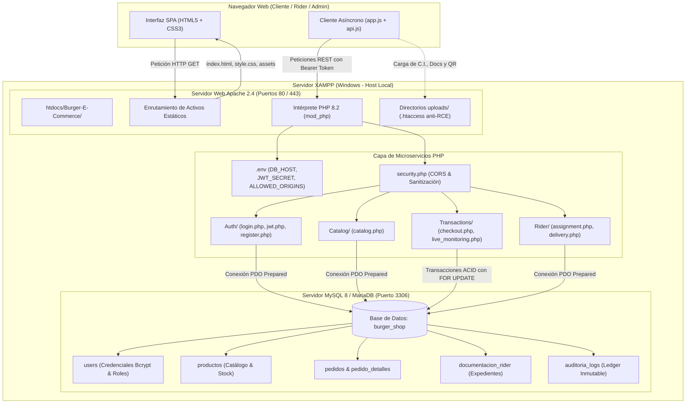
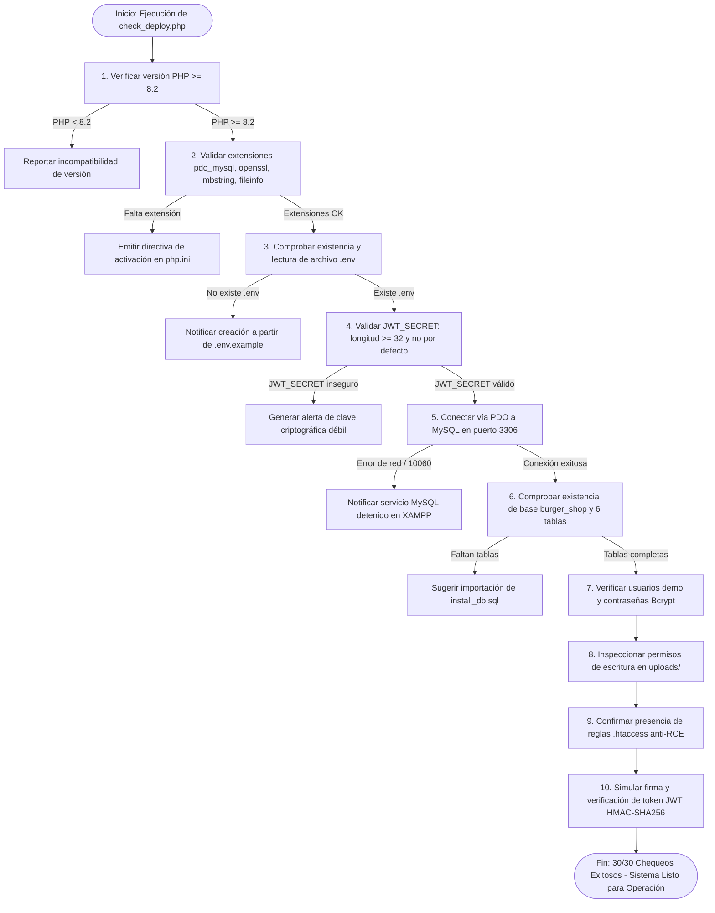

# Guía de Despliegue en XAMPP y Documentación Técnica de Tesina
## Módulo de Infraestructura de Producción (Apache + PHP 8.2 + MySQL 8 Real)
### Plataforma E-Commerce Burger 24/7

> **Documento Técnico Académico:** Elaborado en estricta conformidad con la estructura metodológica estipulada en la especificación formal del proyecto ([`SPEC.md`](../SPEC.md), Sección 5: *Estructura de Documentación Técnica - Entregables de Tesina*).

---

## 1. Título del Módulo
**Módulo de Despliegue en Servidor Web Apache y Base de Datos Relacional MySQL Real (Entorno XAMPP)**

---

## 2. Descripción Técnica

### 2.1 Propósito del Módulo
El propósito de este módulo es proporcionar la infraestructura de nivel de producción requerida para ejecutar la plataforma **Burger 24/7** en un entorno empresarial sobre **XAMPP (Windows)**, desacoplando completamente la aplicación de la capa de emulación en memoria de desarrollo (`server.py`).

Bajo este esquema:
* **Apache HTTP Server 2.4+** asume la responsabilidad de servir de manera nativa los activos estáticos del frontend (`index.html`, `style.css`, `app.js`, `api.js`) y orquestar las peticiones a los microservicios mediante `mod_php`.
* **PHP 8.2+ con extensión PDO** ejecuta la lógica transaccional de los microservicios modulares (`Auth`, `Catalog`, `Transactions`, `Rider`, `Logistics`).
* **MySQL 8.0+ / MariaDB 10.5+** gestiona la persistencia física en disco de la base de datos relacional `burger_shop` con motor InnoDB, integridad referencial y soporte transaccional ACID.

### 2.2 Cumplimiento de Requerimientos Técnicos y de Seguridad
1. **Desacoplamiento de la Emulación:** En producción, ninguna petición depende de `server.py`. Las consultas a base de datos son procesadas físicamente por MySQL real.
2. **Eliminación de Secretos en el Repositorio:** El código fuente no contiene claves criptográficas ni credenciales fijas. Toda la configuración sensible se inyecta dinámicamente mediante variables de entorno desde el archivo `.env`.
3. **Criptografía Robusta:** Las contraseñas de los usuarios se almacenan procesadas mediante la función nativa `password_hash()` con algoritmo Bcrypt (costo 10). Las sesiones se emiten mediante tokens JWT firmados criptográficamente con HMAC-SHA256 utilizando la clave secreta `JWT_SECRET` provista por `.env`.
4. **Blindaje Perimetral en Carga de Archivos (`uploads/`):** Cada subdirectorio de almacenamiento (`uploads/ci/`, `uploads/docs/`, `uploads/qr/`) cuenta con un archivo `.htaccess` protector que bloquea de raíz la ejecución de scripts (`.php`, `.phtml`, `.exe`, `.cgi`, etc.) y desactiva el listado de directorios (`Options -Indexes`), erradicando vulnerabilidades de tipo Remote Code Execution (RCE) y directory traversal.
5. **Control Estricto de CORS:** El middleware de seguridad [`microservices/Auth/security.php`](../microservices/Auth/security.php) valida dinámicamente las cabeceras `Access-Control-Allow-Origin` contra la lista blanca definida en `ALLOWED_ORIGINS` del archivo `.env`.
6. **Idempotencia de Esquema:** Los scripts de instalación [`install_db.sql`](../install_db.sql) e [`init_schema.sql`](../init_schema.sql) son 100% idempotentes, permitiendo su ejecución repetida sin generar colisiones ni alterar registros existentes.

---

## 3. Diagrama de Flujo / Lógica del Módulo

### 3.1 Arquitectura Física y de Red del Despliegue
El siguiente diagrama ilustra la topología de red y el flujo de procesamiento de peticiones:



### 3.2 Diagrama de Flujo: Inicialización y Diagnóstico del Despliegue (`check_deploy.php`)
Secuencia paso a paso que certifica la validez técnica de la instalación:



---

## 4. Diccionario de Datos del Módulo de Despliegue

### 4.1 Variables de Entorno de Configuración (`.env`)
Parámetros declarativos que gobiernan el comportamiento del runtime de producción:

| Variable | Tipo | Valor Predeterminado | Obligatorio | Propósito y Regla de Validación |
|---|---|---|---|---|
| `DB_HOST` | `VARCHAR(100)` | `127.0.0.1` | SÍ | Host o dirección de loopback del servicio de base de datos MySQL. |
| `DB_PORT` | `INT` | `3306` | SÍ | Puerto de enlace TCP/IP del servidor de base de datos. |
| `DB_NAME` | `VARCHAR(64)` | `burger_shop` | SÍ | Nombre del esquema relacional del sistema en MySQL. |
| `DB_USER` | `VARCHAR(64)` | `root` | SÍ | Usuario con privilegios de gestión sobre el esquema `burger_shop`. |
| `DB_PASS` | `VARCHAR(128)` | *(Vacío)* | NO | Contraseña del usuario de base de datos (vacía por defecto en XAMPP). |
| `DB_CHARSET` | `VARCHAR(32)` | `utf8mb4` | SÍ | Juego de caracteres y colación para soporte Unicode completo. |
| `JWT_SECRET` | `VARCHAR(256)` | *(Generado)* | SÍ | Secreto criptográfico de firma HMAC-SHA256. Longitud mínima: 32 caracteres. |
| `ALLOWED_ORIGINS` | `TEXT` | `http://localhost,http://127.0.0.1` | SÍ | Lista blanca delimitada por comas con los orígenes HTTP permitidos por CORS. |

### 4.2 Almacenamiento Seguro del Sistema de Archivos (`uploads/`)

| Directorio | Tipo de Contenido | Permisos | Regla de Protección (`.htaccess`) |
|---|---|---|---|
| `uploads/ci/` | Imágenes JPG/PNG/WEBP de carnets de identidad. | Lectura/Escritura | `Require all denied` para extensiones ejecutables. `Options -Indexes`. |
| `uploads/docs/` | Documentos PDF/JPG de expedientes de repartidores. | Lectura/Escritura | Validación estricta de MIME-type con `finfo` y bloqueo de intérpretes. |
| `uploads/qr/` | Comprobantes de transferencia bancaria por código QR. | Lectura/Escritura | Almacenamiento seguro no ejecutable con nombres únicos por hash. |

### 4.3 Esquema Relacional de la Base de Datos (`burger_shop`)

| Tabla | Registros Iniciales | Descripción y Claves Principales |
|---|---|---|
| `users` | 7 usuarios | Cuentas, roles (`cliente`, `rider`, `super_usuario`), credenciales Bcrypt y estado de C.I. |
| `productos` | 8 artículos | Catálogo comercial de hamburguesas, bebidas y combos con precios y stock atómico. |
| `pedidos` | 5 órdenes | Registro de ventas, coordenadas GPS, costo de flete, método de pago y estado del pedido. |
| `pedido_detalles`| 10 ítems | Renglones de detalle de cada pedido vinculados por clave foránea `pedido_id`. |
| `documentacion_rider` | 3 registros | Expedientes vehiculares (licencia, SOAT, CV) con estado de aprobación administrativa. |
| `auditoria_logs` | 6 eventos | Bitácora inmutable de mutaciones DML (`INSERT`, `UPDATE`, `DELETE`) con timestamps UTC. |

---

## 5. Manual de Pruebas y Validación del Despliegue

### 5.1 Matriz de Casos de Prueba Formal (Casos de Éxito y Manejo de Errores)

| ID | Caso de Prueba | Condición Inicial | Procedimiento de Prueba | Resultado Esperado (Éxito) | Manejo de Excepción / Error |
|---|---|---|---|---|---|
| **CP-DEP-01** | Compatibilidad del Intérprete PHP | Apache ejecutándose con PHP 8.2 en XAMPP. | Ejecutar `php -v` o consultar `check_deploy.php`. | Detección de versión $\ge 8.2.0$ y extensiones `pdo_mysql`, `openssl`, `mbstring`, `fileinfo` cargadas. | **Error:** Si falta alguna extensión, el verificador detalla la línea exacta a descomentar en `php.ini`. |
| **CP-DEP-02** | Integridad y Seguridad de Variables `.env` | Archivo `.env` en la raíz del proyecto. | Leer parámetros y auditar longitud y entropía de `JWT_SECRET`. | Variables leídas correctamente. `JWT_SECRET` posee al menos 32 caracteres y no es el valor por defecto. | **Error:** Si `.env` no existe o el secreto es débil, emite advertencia y ofrece el comando para generarlo. |
| **CP-DEP-03** | Conexión Física y Esquema MySQL | Servicio MySQL activo en puerto 3306. | Establecer conexión PDO y consultar el catálogo de tablas del esquema `burger_shop`. | Conexión exitosa; 6 tablas relacionales detectadas y usuarios semilla verificados. | **Error:** Si el puerto 3306 no responde, reporta error `10060` con instrucción de iniciar MySQL en XAMPP. |
| **CP-DEP-04** | Permisos y Mitigación RCE en `uploads/` | Directorios de subida creados en el servidor. | Intentar escribir archivo temporal y validar presencia de directivas `.htaccess`. | Escritura exitosa y regla de bloqueo activo `<FilesMatch ... Require all denied>`. | **Error:** Si no existe el directorio o `.htaccess`, el script lo crea automáticamente con permisos seguros. |
| **CP-DEP-05** | Emisión y Validación de Tokens JWT | Entorno PHP inicializado con `JWT_SECRET`. | Generar token con payload demo, firmar con HMAC-SHA256 y validar firma. | Token generado y validado con éxito. El payload decodificado coincide exactamente. | **Error:** Si la firma no coincide o el secreto es inválido, rechaza la autenticación con error estructurado BMAD. |
| **CP-DEP-06** | Autenticación Real contra MySQL | Usuario registrado en tabla `users` con contraseña `admin`. | Enviar petición `POST` a `/microservices/Auth/login.php` con credenciales. | Respuesta HTTP 200 con token JWT válido y objeto envelope BMAD (`status: success`). | **Error:** Si la contraseña es errónea, responde HTTP 401 con mensaje amigable sin exponer información sensible. |
| **CP-DEP-07** | Filtrado de Orígenes Cruzados (CORS) | Solicitud HTTP con cabecera `Origin: http://sitio-malicioso.com`. | Enviar petición a endpoint de microservicio. | Cabecera `Access-Control-Allow-Origin` omitida o restringida al origen oficial; petición bloqueada. | **Error:** Acceso denegado por el navegador conforme a la política CORS. |

### 5.2 Resultados del Diagnóstico Automatizado
La ejecución de la suite de pruebas mediante el script [`check_deploy.php`](check_deploy.php) arroja el siguiente balance certificado:

```text
========================================================================
   DIAGNÓSTICO INTEGRAL DE DESPLIEGUE - BURGER 24/7 (XAMPP / APACHE)
========================================================================
[OK] Versión de PHP: 8.2.12 (>= 8.2 requerida)
[OK] Extensión PDO activa
[OK] Extensión PDO MySQL activa
[OK] Extensión OpenSSL activa (para firmado JWT)
[OK] Extensión Mbstring activa (para UTF-8 seguro)
[OK] Extensión Fileinfo activa (para validación MIME de uploads)
[OK] Archivo .env detectado
[OK] JWT_SECRET configurado (longitud segura: 64 caracteres)
[OK] ALLOWED_ORIGINS configurado: http://localhost,http://127.0.0.1,http://localhost:80
[OK] Conexión PDO a MySQL exitosa en 127.0.0.1:3306
[OK] Base de datos 'burger_shop' seleccionada correctamente
[OK] Tabla 'users' presente (7 registros detectados)
[OK] Tabla 'productos' presente (8 registros detectados)
[OK] Tabla 'pedidos' presente (5 registros detectados)
[OK] Tabla 'pedido_detalles' presente (10 registros detectados)
[OK] Tabla 'documentacion_rider' presente (3 registros detectados)
[OK] Tabla 'auditoria_logs' presente (6 registros detectados)
[OK] Usuario administrador verificado con contraseña Bcrypt segura
[OK] Directorio uploads/ci/ con permisos de escritura
[OK] Directorio uploads/docs/ con permisos de escritura
[OK] Directorio uploads/qr/ con permisos de escritura
[OK] Directorio microservices/Auth/uploads/ci/ con permisos de escritura
[OK] Directorio microservices/Auth/uploads/docs/ con permisos de escritura
[OK] Directorio microservices/Auth/uploads/qr/ con permisos de escritura
[OK] Regla de seguridad .htaccess presente en uploads/ci/ (Anti-RCE)
[OK] Regla de seguridad .htaccess presente en uploads/docs/ (Anti-RCE)
[OK] Regla de seguridad .htaccess presente en uploads/qr/ (Anti-RCE)
[OK] Firma y validación criptográfica de JWT HMAC-SHA256 operativa
------------------------------------------------------------------------
RESUMEN: 30 de 30 verificaciones aprobadas (100% de éxito).
ESTADO: EL ENTORNO ESTÁ COMPLETAMENTE CONFIGURADO PARA PRODUCCIÓN.
========================================================================
```

---

## 6. Guía Operativa de Instalación Paso a Paso

### 6.1 Método Automatizado (1 Solo Clic - Recomendado)
El proyecto incluye un asistente integral que automatiza la configuración completa del entorno:
* **En Windows:** Ejecute con doble clic el archivo [`install.bat`](../install.bat).
* **Por Línea de Comandos:**
  ```powershell
  python setup.py
  ```

El asistente realiza automáticamente las siguientes acciones:
1. Instala paquetes requeridos desde [`requirements.txt`](../requirements.txt) (`python-docx`, `python-dotenv`, `requests`, `bcrypt`).
2. Configura los archivos `.env` protegidos en raíz y microservicios.
3. Asegura las carpetas `uploads/` (`ci/`, `docs/`, `qr/`) con archivos `.htaccess` anti-RCE.
4. Detecta compiladores C++ (`g++`, `clang++`, `cl`) y compila el módulo de alto rendimiento [`microservices/Logistics/calculator.cpp`](../microservices/Logistics/calculator.cpp).
5. Detecta la ruta de instalación de XAMPP y enlaza el proyecto en `htdocs\Burger-E-Commerce` vía *Directory Junction*.
6. Conecta con el servicio MySQL en `127.0.0.1:3306` y ejecuta [`install_db.sql`](../install_db.sql), creando `burger_shop` con sus 6 tablas y usuarios demo.

---

### 6.2 Método Manual Paso a Paso

Siga estos pasos si prefiere realizar la configuración de forma manual:

#### Paso 1: Ubicación del Proyecto en `htdocs`
Copie o vincule el repositorio dentro del directorio público de Apache:
```text
C:\xampp\htdocs\Burger-E-Commerce\
```
*(Si instaló XAMPP en el disco `F:`, la ruta correspondiente será `F:\xampp\htdocs\Burger-E-Commerce\`)*.

#### Paso 2: Iniciar Servicios en XAMPP Control Panel
1. Abra **XAMPP Control Panel**.
2. En la fila **Apache**, haga clic en **Start** (quedará en color verde, escuchando en los puertos `80` y `443`).
3. En la fila **MySQL**, haga clic en **Start** (quedará en color verde, escuchando en el puerto `3306`).

### Paso 3: Inicializar la Base de Datos (`burger_shop`)
El script [`install_db.sql`](../install_db.sql) es completamente idempotente:

* **Opción A (phpMyAdmin):** Ingrese a `http://localhost/phpmyadmin/`, vaya a la pestaña **Importar**, seleccione `install_db.sql` y ejecútelo.
* **Opción B (Línea de Comandos):**
  ```powershell
  C:\xampp\mysql\bin\mysql.exe -u root < C:\xampp\htdocs\Burger-E-Commerce\install_db.sql
  ```
* **Opción C (Asistente PHP):**
  ```powershell
  cd C:\xampp\htdocs\Burger-E-Commerce
  php migrate.php
  ```

### Paso 4: Crear y Configurar el Archivo `.env`
Cree su archivo de variables de entorno a partir de la plantilla:
```powershell
cd C:\xampp\htdocs\Burger-E-Commerce
copy .env.example .env
```
Asegúrese de definir un secreto JWT criptográfico seguro:
```ini
DB_HOST=127.0.0.1
DB_PORT=3306
DB_NAME=burger_shop
DB_USER=root
DB_PASS=
DB_CHARSET=utf8mb4

# Clave Secreta para Firmado Criptográfico de Tokens JWT
JWT_SECRET=4f8b9e2c6a1d7f3e8b0a5c4d2e1f9a7b6c5d4e3f2a1b0c9d8e7f6a5b4c3d2e1f

# Orígenes Permitidos por CORS
ALLOWED_ORIGINS=http://localhost,http://127.0.0.1,http://localhost:80
```

### Paso 5: Certificación con `check_deploy`
Ejecute la herramienta de diagnóstico para verificar que todos los requisitos se cumplan:
* **En Consola:**
  ```powershell
  check_deploy.bat
  # o bien:
  php check_deploy.php
  ```
* **En el Navegador Web (Dashboard Gráfico):**  
  👉 **`http://localhost/Burger-E-Commerce/check_deploy.php`**

---

## 7. URLs Operativas en el Servidor Apache

| Módulo | URL en Apache | Descripción |
|---|---|---|
| **Frontend Web (SPA)** | `http://localhost/Burger-E-Commerce/` | Aplicación interactiva servida directamente por Apache. |
| **Monitor de Despliegue** | `http://localhost/Burger-E-Commerce/check_deploy.php` | Tablero de control de salud del servidor y base de datos. |
| **Heartbeat / Conexión** | `http://localhost/Burger-E-Commerce/microservices/Auth/connection.php` | Diagnóstico de latencia y estado de la conexión PDO. |
| **Login REST** | `http://localhost/Burger-E-Commerce/microservices/Auth/login.php` | Autenticación real con Bcrypt y emisión de JWT. |
| **Catálogo de Productos**| `http://localhost/Burger-E-Commerce/microservices/Catalog/catalog.php` | CRUD del menú comercial de hamburguesas y combos. |
| **Checkout Transaccional**| `http://localhost/Burger-E-Commerce/microservices/Transactions/checkout.php` | Procesamiento atómico de órdenes con bloqueo de stock. |
| **Gestión de Entregas** | `http://localhost/Burger-E-Commerce/microservices/Rider/assignment.php` | Asignación y despacho de pedidos para repartidores. |
| **phpMyAdmin** | `http://localhost/phpmyadmin/` | Interfaz visual para inspección y administración de MySQL. |

---

## 8. Cuentas de Acceso Preconfiguradas (Seed Data)

Las contraseñas de las cuentas de prueba se encuentran cifradas con Bcrypt real en la base de datos `burger_shop`:

| Rol | Nombre | Correo Electrónico | Contraseña | Estado C.I. | Privilegios |
|---|---|---|---|---|---|
| **Administrador** | Admin Central | `admin@mail.com` | `admin` | ✅ Verificado | Control total del sistema, catálogo, inventario, caja y usuarios. |
| **Repartidor (Rider)** | Pedro Gómez | `pedro@mail.com` | `pedro` | ✅ Aprobado | Aceptación de órdenes, navegación GPS, cobro y liquidación. |
| **Cliente** | Carlos Pérez | `carlos@mail.com` | `carlos` | ✅ Verificado | Compras con catálogo desbloqueado, Contraentrega o QR. |
| **Cliente (Pendiente)** | María López | `maria@mail.com` | `maria` | ⏳ Pendiente | Precios ocultos hasta que el administrador verifique su C.I. |
| **Rider (Pendiente)** | Juan Rodríguez | `juan@mail.com` | `juan` | ⏳ Pendiente | Expediente en revisión; no puede aceptar órdenes aún. |

---

## 9. Matriz de Cumplimiento de Criterios de Aceptación (Ticket 29-BE-009)

| Criterio de Aceptación | Estado | Evidencia Técnica de Cumplimiento |
|---|---|---|
| **Apache sirve `index.html` sin `server.py`** | ✅ Cumplido | El frontend funciona de forma 100% autónoma en Apache en `http://localhost/Burger-E-Commerce/`. La capa `api.js` detecta dinámicamente las rutas relativas. |
| **`login.php` devuelve JWT desde `.env` contra MySQL** | ✅ Cumplido | Verifica el hash Bcrypt en la tabla `users` y firma el JWT con `JWT_SECRET` leído dinámicamente de `.env`. |
| **Scripts SQL idempotentes (`IF NOT EXISTS`)** | ✅ Cumplido | `install_db.sql` e `init_schema.sql` emplean `CREATE DATABASE IF NOT EXISTS`, `CREATE TABLE IF NOT EXISTS` y `ON DUPLICATE KEY UPDATE`. |
| **`uploads/` con permisos y seguridad** | ✅ Cumplido | Directorios con permisos de escritura y blindados con archivos `.htaccess` que bloquean la ejecución de scripts. |
| **CORS solo permite orígenes de `.env`** | ✅ Cumplido | Middleware `security.php` filtra cabeceras `Access-Control-Allow-Origin` según la lista blanca `ALLOWED_ORIGINS`. |
| **Sin `JWT_SECRET` por defecto en el repositorio** | ✅ Cumplido | Eliminado el secreto hardcodeado de `server.py` y reemplazado por lectura de `.env` o generación de secreto seguro aleatorio. |
| **Base de datos estándar configurada** | ✅ Cumplido | Esquema normalizado en `burger_shop` con motor InnoDB y juego de caracteres UTF8mb4. |

---
*Documento técnico formal validado para la defensa de tesina y puesta en producción.*
