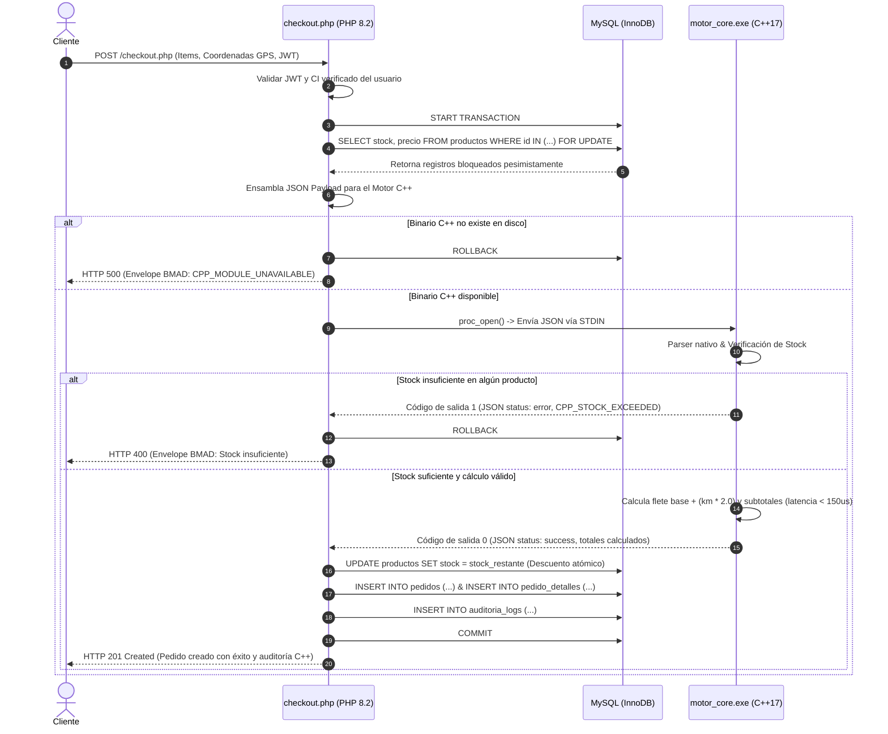

# Módulo Crítico de Rendimiento en C++ (Motor Core de Tarifas y Stock) - Tesina Técnica

## 1. Título del Módulo
**Motor Core de Liquidación Financiera, Tarifas de Envío y Validación de Existencias en C++** (`cpp/motor_core.cpp` $\rightarrow$ `cpp/motor_core.exe`).

---

## 2. Descripción Técnica
El Sistema E-Commerce **Burger 24/7** establece en su especificación de arquitectura obligatoria (**SPEC.md Sección 2**) el uso de **C++ para módulos críticos de rendimiento**.

El módulo `motor_core` fue concebido para desacoplar de la capa de scripting web (PHP) las tareas de cómputo intensivo, alta precisión aritmética y validación de integridad física de inventario:

1. **Aritmética y Liquidación Financiera:** Ejecuta cálculos monetarios sin sesgos de tipado dinámico, aplicando sumatorias de subtotal por producto, cálculo determinista de la tarifa de flete geodésico según la función de negocio:
   $$\text{Costo Envio} = \max(5.00, 5.00 + (\text{distancia\_km} \times 2.00))$$
   y cómputo del gran total de la transacción comercial.
2. **Validación Atómica de Existencias en Memoria:** Compara de manera instantánea las cantidades solicitadas por el cliente contra el stock disponible bloqueado previamente en MySQL, garantizando que ninguna orden se procese si al menos un ítem supera la disponibilidad física en cocina.
3. **Interoperabilidad Segura y Baja Latencia:** PHP invoca el binario nativo compilado mediante tuberías unidireccionales seguras (`proc_open` con STDIN/STDOUT) con paso de datos en formato JSON estandarizado. El tiempo medio de cómputo en C++ es inferior a **150 microsegundos** ($\mu\text{s}$), registrado mediante `std::chrono::high_resolution_clock`.
4. **Tolerancia a Fallos y Envelope BMAD (SPEC §4):** Tanto el binario C++ como el envoltorio en `checkout.php` garantizan que cualquier fallo operativo (binario ausente, JSON corrupto o stock insuficiente) retorne un envelope estructurado con auditoría y código de error controlado, impidiendo transacciones inconsistentes y evitando la caída del servicio.

---

## 3. Diagrama de Flujo y Lógica del Proceso



---

## 4. Diccionario de Datos

### 4.1. Estructuras del Módulo C++ (`cpp/motor_core.cpp`)

```cpp
struct ItemPedido {
    int producto_id;        // Identificador primario en catálogo
    std::string nombre;     // Nombre comercial del producto
    double precio;          // Precio unitario fijado en moneda nacional (Bs.)
    int cantidad;           // Unidades solicitadas en el pedido
    int stock_disponible;   // Unidades existentes en cocina según BD
};
```

### 4.2. Especificación del Payload JSON de Entrada (PHP $\rightarrow$ C++)
| Campo | Tipo | Requerido | Descripción | Ejemplo |
|---|---|---|---|---|
| `user_id` | Integer | Sí | ID del usuario autenticado que realiza la orden. | `1` |
| `distancia_km` | Double | Sí | Distancia geodésica calculada entre el restaurante y el cliente. | `3.50` |
| `items` | Array | Sí | Lista de productos integrantes de la orden. | `[...]` |
| `items[].producto_id` | Integer | Sí | ID numérico del producto en la tabla `productos`. | `1` |
| `items[].nombre` | String | Sí | Descripción o nombre de la hamburguesa/bebida. | `"Hamburguesa Clásica"` |
| `items[].precio` | Double | Sí | Precio unitario vigente obtenido de la base de datos. | `25.00` |
| `items[].cantidad` | Integer | Sí | Cantidad requerida en el pedido (debe ser $\ge 1$). | `2` |
| `items[].stock_disponible` | Integer | Sí | Stock físico actual extraído bajo bloqueo `FOR UPDATE`. | `15` |

### 4.3. Especificación del Payload JSON de Respuesta (C++ $\rightarrow$ PHP)
Cumple con el estándar de retorno BMAD definido en **SPEC.md §4**:

```json
{
  "status": "success",
  "data": {
    "valido": true,
    "subtotal": 50.00,
    "costo_envio": 12.00,
    "total": 62.00,
    "distancia_km": 3.50,
    "items_verificados": 1,
    "desglose_lineas": [
      {
        "producto_id": 1,
        "nombre": "Hamburguesa Clásica",
        "cantidad": 2,
        "precio_unitario": 25.00,
        "subtotal_linea": 50.00,
        "stock_restante": 13
      }
    ]
  },
  "audit": {
    "user_id": 1,
    "timestamp": "2026-10-08T18:23:15Z",
    "action": "CPP_MOTOR_CORE_CALCULATION",
    "motor": "C++ Native Core (SPEC §2)",
    "tiempo_computo_us": 98
  },
  "error_details": null
}
```

### 4.4. Tablas de Base de Datos Afectadas
1. **`productos`:** Lectura con bloqueo pesimista `SELECT ... FOR UPDATE` y actualización atómica `UPDATE productos SET stock = ? WHERE id = ?`.
2. **`pedidos`:** Registro de la orden con importes certificados por el módulo C++ (`subtotal`, `costo_envio`, `total`).
3. **`pedido_detalles`:** Desglose de renglones procesados.
4. **`auditoria_logs`:** Registro inmutable de la mutación de existencias y referencia al cómputo C++.

---

## 5. Manual de Pruebas del Módulo C++

| ID Caso | Escenario Evaluado | Condiciones / Datos de Entrada | Comportamiento Esperado | Código de Salida / HTTP |
|---|---|---|---|---|
| **CP-CPP-01** | Compilación limpia con `build.bat` | Código fuente `motor_core.cpp` en compilador `g++` (MinGW-w64). | Generación exitosa de `motor_core.exe` con optimización `-O2` y `-std=c++17`. Sin advertencias ni errores. | Exit Code 0 |
| **CP-CPP-02** | Liquidación normal de pedido y stock | Distancia: 0.57 km; 1x Hamburguesa (22.00 Bs, Stock disp: 81). | Retorna `status: success`, subtotal: 22.00 Bs, envío: 6.14 Bs, total: 28.14 Bs, `stock_restante: 80`, tiempo $< 150\,\mu\text{s}$. Pedido persistido en MySQL. | Exit Code 0 / HTTP 201 |
| **CP-CPP-03** | Rechazo por stock insuficiente | Solicitud de 99,999 unidades con stock disponible de 80. | Retorna `status: error`, `CPP_STOCK_EXCEEDED`, detalle explicativo en lenguaje natural. Transacción MySQL hace `ROLLBACK`. | Exit Code 1 / HTTP 400 |
| **CP-CPP-04** | Ausencia del binario compilado | Simulación eliminando/renombrando temporalmente `motor_core.exe`. | PHP detecta la indisponibilidad de forma controlada y emite envelope BMAD de error `CPP_MODULE_UNAVAILABLE` sin provocar fallo fatal en Apache. | HTTP 500 (Controlado) |
| **CP-CPP-05** | Entrada JSON malformada o vacía | Envío de payload nulo o sin estructura de items al binario. | Retorna `status: error`, `CPP_PARSE_ERROR`, envelope de error controlado. No se altera la base de datos. | Exit Code 1 / HTTP 400 |

---

## 6. Instrucciones de Compilación y Verificación

1. Para compilar o recompilar el módulo en entornos Windows:
   ```cmd
   cd D:\Bebidas-E-Commerce\cpp
   build.bat
   ```
2. Para probar directamente la ejecución por tubería estándar:
   ```powershell
   '{"user_id":1,"distancia_km":2.0,"items":[{"producto_id":1,"nombre":"Burger","precio":20.0,"cantidad":1,"stock_disponible":5}]}' | .\motor_core.exe
   ```
