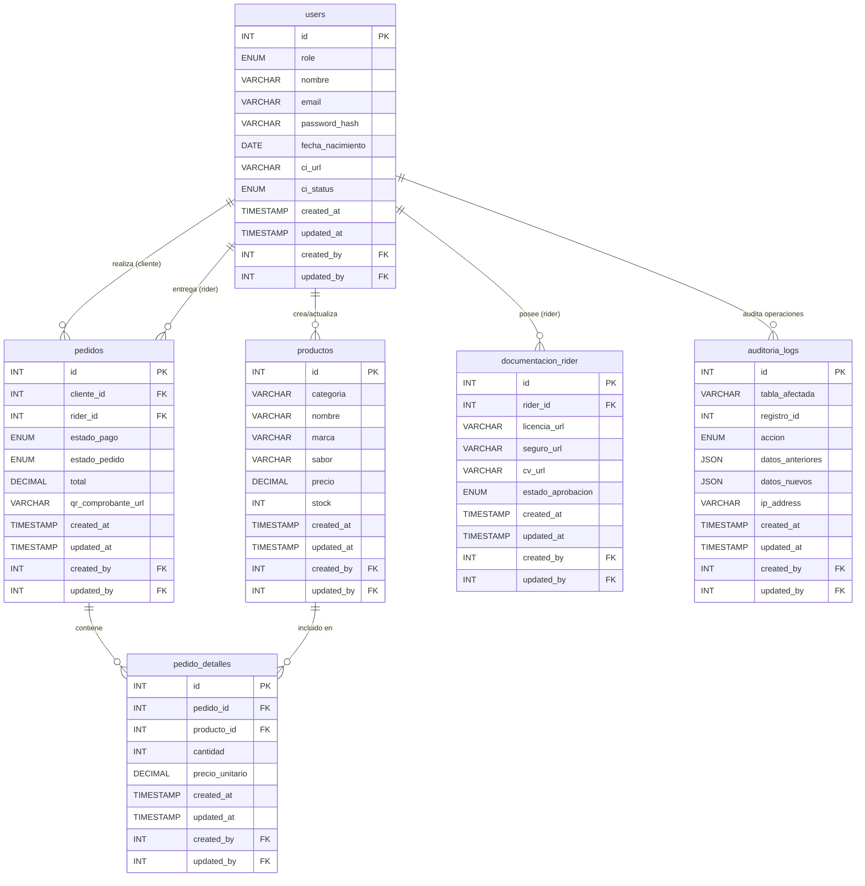
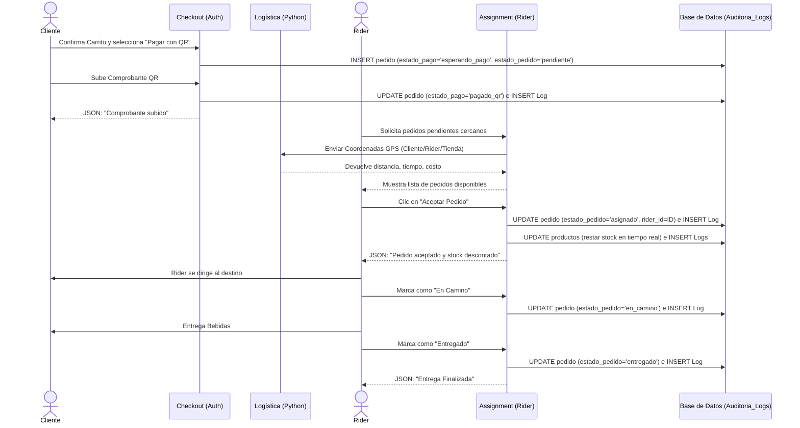

# Diagramas del Sistema - Tesina

## Diagrama Entidad-Relación (DER)
El siguiente diagrama muestra la estructura completa de la base de datos, incluyendo la tabla de usuarios, transacciones y la auditoría obligatoria.

## Diagrama de Proceso: Transacción y Despacho
Este diagrama de flujo describe el ciclo de vida de un pedido, desde que el Cliente procesa el pago hasta que el Rider realiza la entrega, incluyendo las validaciones de auditoría.

