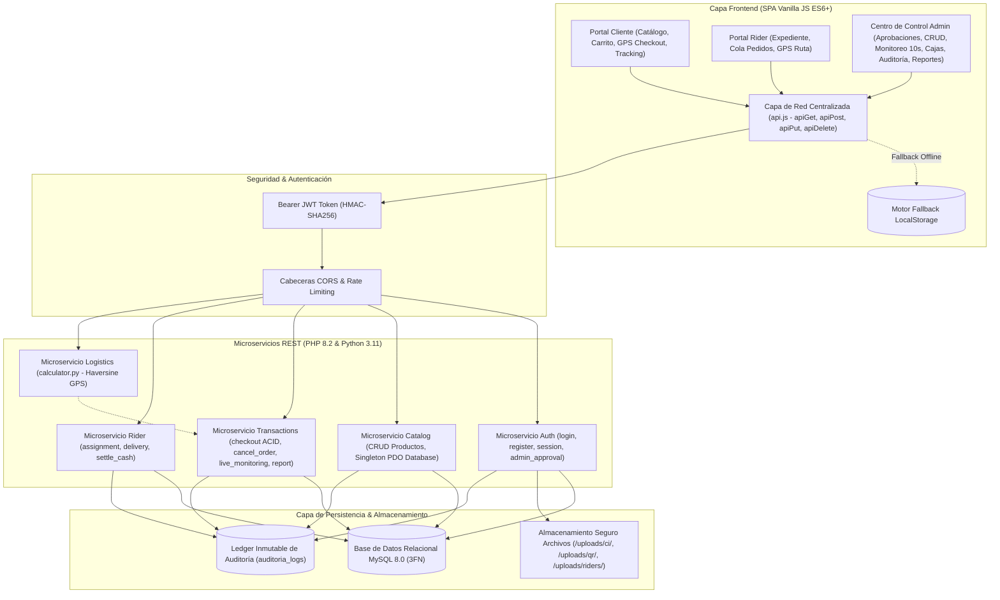
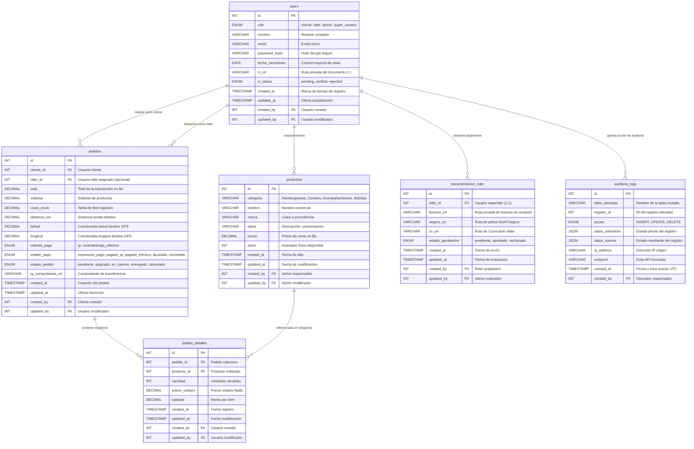
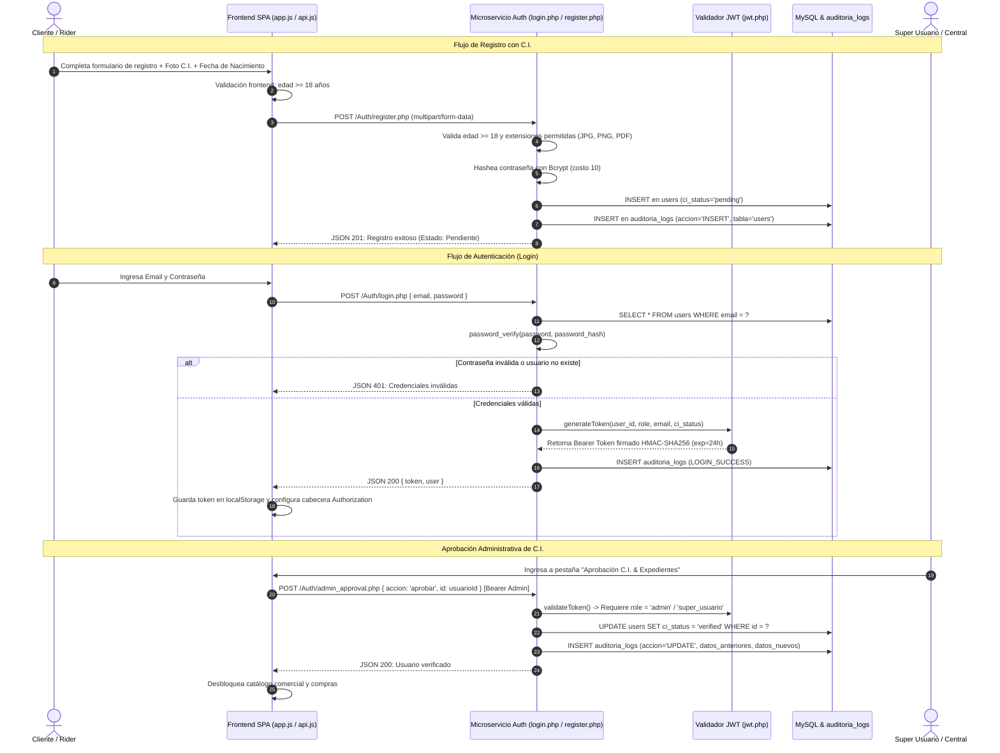
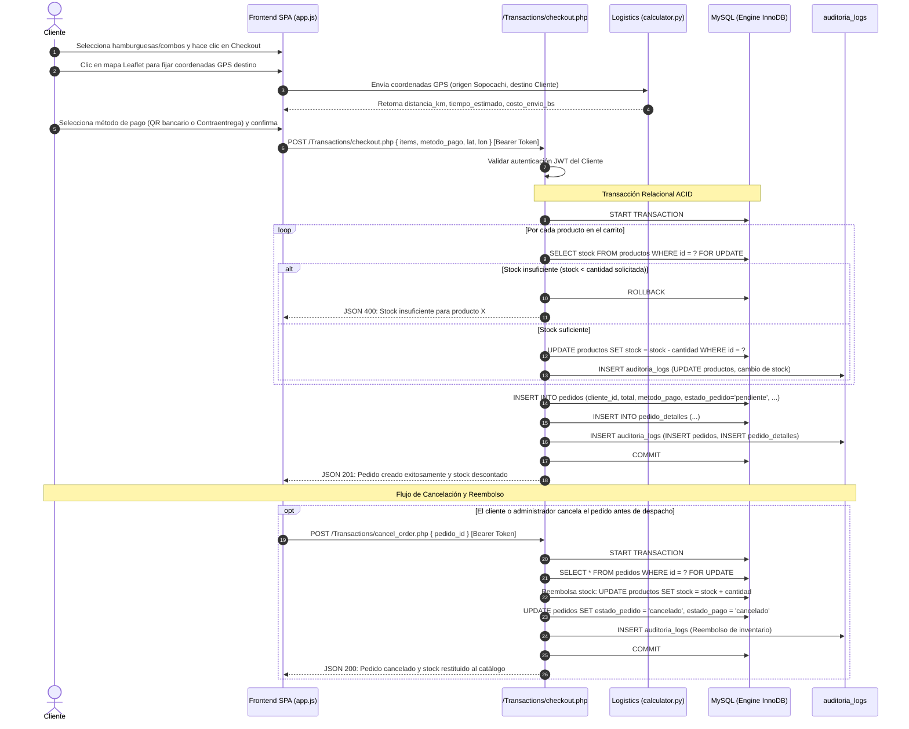
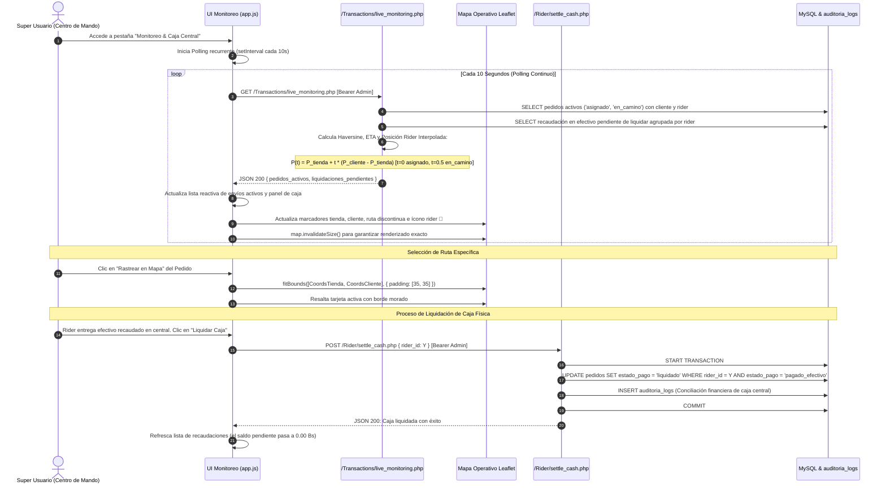

# Diagramas del Sistema - Tesina Técnica

## 1. Arquitectura General del Sistema y Microservicios

El sistema **Burger 24/7** opera bajo una arquitectura distribuida de microservicios desacoplados, comunicados mediante el protocolo HTTP REST bajo el estándar de sobres **BMAD** (`status`, `data`, `audit`, `error_details`). El frontend es una Single Page Application (SPA) responsiva con soporte de modo dual (conectado vía API REST y simulado con `localStorage` como fallback resiliente).

```mermaid
graph TD
    subgraph Frontend ["Capa Frontend (SPA Vanilla JS ES6+)"]
        UI_Client["Portal Cliente (Catálogo, Carrito, GPS Checkout, Tracking)"]
        UI_Rider["Portal Rider (Expediente, Cola Pedidos, GPS Ruta)"]
        UI_Admin["Centro de Control Admin (Aprobaciones, CRUD, Monitoreo 10s, Cajas, Auditoría, Reportes)"]
        APILayer["Capa de Red Centralizada (api.js - apiGet, apiPost, apiPut, apiDelete)"]
        LocalDB[("Motor Fallback LocalStorage")]
    end

    subgraph Gateway ["Seguridad & Autenticación"]
        AuthHeader["Bearer JWT Token (HMAC-SHA256)"]
        CORS["Cabeceras CORS & Rate Limiting"]
    end

    subgraph Backend ["Microservicios REST (PHP 8.2 & Python 3.11)"]
        MS_Auth["Microservicio Auth (login, register, session, admin_approval)"]
        MS_Catalog["Microservicio Catalog (CRUD Productos, Singleton PDO Database)"]
        MS_Trans["Microservicio Transactions (checkout ACID, cancel_order, live_monitoring, report)"]
        MS_Rider["Microservicio Rider (assignment, delivery, settle_cash)"]
        MS_Logistics["Microservicio Logistics (calculator.py - Haversine GPS)"]
    end

    subgraph Data ["Capa de Persistencia & Almacenamiento"]
        MySQL[("Base de Datos Relacional MySQL 8.0 (3FN)")]
        Storage["Almacenamiento Seguro Archivos (/uploads/ci/, /uploads/qr/, /uploads/riders/)"]
        AuditLedger[("Ledger Inmutable de Auditoría (auditoria_logs)")]
    end

    UI_Client --> APILayer
    UI_Rider --> APILayer
    UI_Admin --> APILayer
    APILayer -.->|Fallback Offline| LocalDB

    APILayer --> AuthHeader
    AuthHeader --> CORS
    CORS --> MS_Auth
    CORS --> MS_Catalog
    CORS --> MS_Trans
    CORS --> MS_Rider
    CORS --> MS_Logistics

    MS_Auth --> MySQL
    MS_Auth --> Storage
    MS_Catalog --> MySQL
    MS_Trans --> MySQL
    MS_Rider --> MySQL
    MS_Logistics -.-> MS_Trans

    MS_Auth --> AuditLedger
    MS_Catalog --> AuditLedger
    MS_Trans --> AuditLedger
    MS_Rider --> AuditLedger
```

---

## 2. Diagrama Entidad-Relación (DER) Físico

Estructura normalizada en Tercera Forma Normal (3FN) que soporta el ciclo de vida completo de usuarios, catálogo comercial, transacciones financieras, expedientes de repartidores y auditoría inalterable.

```mermaid
erDiagram
    users {
        INT id PK
        ENUM role "cliente, rider, admin, super_usuario"
        VARCHAR nombre "Nombre completo"
        VARCHAR email "Email único"
        VARCHAR password_hash "Hash Bcrypt seguro"
        DATE fecha_nacimiento "Control mayoría de edad"
        VARCHAR ci_url "Ruta privada del documento C.I."
        ENUM ci_status "pending, verified, rejected"
        TIMESTAMP created_at "Marca de tiempo de registro"
        TIMESTAMP updated_at "Última actualización"
        INT created_by FK "Usuario creador"
        INT updated_by FK "Usuario modificador"
    }

    productos {
        INT id PK
        VARCHAR categoria "Hamburguesas, Combos, Acompañamientos, Bebidas"
        VARCHAR nombre "Nombre comercial"
        VARCHAR marca "Línea o procedencia"
        VARCHAR sabor "Descripción / presentación"
        DECIMAL precio "Precio de venta en Bs"
        INT stock "Inventario físico disponible"
        TIMESTAMP created_at "Fecha de alta"
        TIMESTAMP updated_at "Fecha de modificación"
        INT created_by FK "Admin responsable"
        INT updated_by FK "Admin modificador"
    }

    pedidos {
        INT id PK
        INT cliente_id FK "Usuario cliente"
        INT rider_id FK "Usuario rider asignado (opcional)"
        DECIMAL total "Total de la transacción en Bs"
        DECIMAL subtotal "Subtotal de productos"
        DECIMAL costo_envio "Tarifa de flete logístico"
        DECIMAL distancia_km "Distancia tienda-destino"
        DECIMAL latitud "Coordenada latitud destino GPS"
        DECIMAL longitud "Coordenada longitud destino GPS"
        ENUM metodo_pago "qr, contraentrega_efectivo"
        ENUM estado_pago "esperando_pago, pagado_qr, pagado_efectivo, liquidado, cancelado"
        ENUM estado_pedido "pendiente, asignado, en_camino, entregado, cancelado"
        VARCHAR qr_comprobante_url "Comprobante de transferencia"
        TIMESTAMP created_at "Creación del pedido"
        TIMESTAMP updated_at "Última transición"
        INT created_by FK "Cliente creador"
        INT updated_by FK "Usuario modificador"
    }

    pedido_detalles {
        INT id PK
        INT pedido_id FK "Pedido cabecera"
        INT producto_id FK "Producto enlazado"
        INT cantidad "Unidades vendidas"
        DECIMAL precio_unitario "Precio unitario fijado"
        DECIMAL subtotal "Monto por ítem"
        TIMESTAMP created_at "Fecha registro"
        TIMESTAMP updated_at "Fecha modificación"
        INT created_by FK "Usuario creador"
        INT updated_by FK "Usuario modificador"
    }

    documentacion_rider {
        INT id PK
        INT rider_id FK "Usuario repartidor (1:1)"
        VARCHAR licencia_url "Ruta privada de licencia de conducir"
        VARCHAR seguro_url "Ruta de póliza SOAT/seguro"
        VARCHAR cv_url "Ruta de Curriculum Vitae"
        ENUM estado_aprobacion "pendiente, aprobado, rechazado"
        TIMESTAMP created_at "Fecha de envío"
        TIMESTAMP updated_at "Fecha de evaluación"
        INT created_by FK "Rider propietario"
        INT updated_by FK "Admin evaluador"
    }

    auditoria_logs {
        INT id PK
        VARCHAR tabla_afectada "Nombre de la tabla mutada"
        INT registro_id "ID del registro afectado"
        ENUM accion "INSERT, UPDATE, DELETE"
        JSON datos_anteriores "Estado previo del registro"
        JSON datos_nuevos "Estado resultante del registro"
        VARCHAR ip_address "Dirección IP origen"
        VARCHAR endpoint "Ruta API invocada"
        TIMESTAMP created_at "Fecha y hora exacta UTC"
        INT created_by FK "Operador responsable"
    }

    users ||--o{ productos : "crea/administra"
    users ||--o{ pedidos : "realiza como cliente"
    users ||--o{ pedidos : "despacha como rider"
    users ||--o{ documentacion_rider : "presenta expediente"
    users ||--o{ auditoria_logs : "genera acción de auditoría"

    pedidos ||--o{ pedido_detalles : "contiene renglones"
    productos ||--o{ pedido_detalles : "referenciado en renglones"
```

---

## 3. Diagrama de Flujo: Autenticación, Registro y Control de Identidad

Describe el ciclo de vida de autenticación mediante JWT (HMAC-SHA256) y el flujo de verificación de mayoría de edad y expediente de identidad.

```mermaid
sequenceDiagram
    autonumber
    actor Usuario as Cliente / Rider
    participant Frontend as Frontend SPA (app.js / api.js)
    participant AuthAPI as Microservicio Auth (login.php / register.php)
    participant JWT as Validador JWT (jwt.php)
    participant DB as MySQL & auditoria_logs
    actor Admin as Super Usuario / Central

    Note over Usuario,Admin: Flujo de Registro con C.I.
    Usuario->>Frontend: Completa formulario de registro + Foto C.I. + Fecha de Nacimiento
    Frontend->>Frontend: Validación frontend: edad >= 18 años
    Frontend->>AuthAPI: POST /Auth/register.php (multipart/form-data)
    AuthAPI->>AuthAPI: Valida edad >= 18 y extensiones permitidas (JPG, PNG, PDF)
    AuthAPI->>AuthAPI: Hashea contraseña con Bcrypt (costo 10)
    AuthAPI->>DB: INSERT en users (ci_status='pending')
    AuthAPI->>DB: INSERT en auditoria_logs (accion='INSERT', tabla='users')
    AuthAPI-->>Frontend: JSON 201: Registro exitoso (Estado: Pendiente)

    Note over Usuario,Admin: Flujo de Autenticación (Login)
    Usuario->>Frontend: Ingresa Email y Contraseña
    Frontend->>AuthAPI: POST /Auth/login.php { email, password }
    AuthAPI->>DB: SELECT * FROM users WHERE email = ?
    AuthAPI->>AuthAPI: password_verify(password, password_hash)
    alt Contraseña inválida o usuario no existe
        AuthAPI-->>Frontend: JSON 401: Credenciales inválidas
    else Credenciales válidas
        AuthAPI->>JWT: generateToken(user_id, role, email, ci_status)
        JWT-->>AuthAPI: Retorna Bearer Token firmado HMAC-SHA256 (exp=24h)
        AuthAPI->>DB: INSERT auditoria_logs (LOGIN_SUCCESS)
        AuthAPI-->>Frontend: JSON 200 { token, user }
        Frontend->>Frontend: Guarda token en localStorage y configura cabecera Authorization
    end

    Note over Usuario,Admin: Aprobación Administrativa de C.I.
    Admin->>Frontend: Ingresa a pestaña "Aprobación C.I. & Expedientes"
    Frontend->>AuthAPI: POST /Auth/admin_approval.php { accion: 'aprobar', id: usuarioId } [Bearer Admin]
    AuthAPI->>JWT: validateToken() -> Requiere role = 'admin' / 'super_usuario'
    AuthAPI->>DB: UPDATE users SET ci_status = 'verified' WHERE id = ?
    AuthAPI->>DB: INSERT auditoria_logs (accion='UPDATE', datos_anteriores, datos_nuevos)
    AuthAPI-->>Frontend: JSON 200: Usuario verificado
    Frontend->>Frontend: Desbloquea catálogo comercial y compras
```

---

## 4. Diagrama de Flujo: Checkout Atómico y Gestión de Inventario

Describe el proceso de compra con validación geoespacial, cálculo de flete logístico, reserva atómica de stock mediante transacción MySQL ACID (`BEGIN` $\rightarrow$ `COMMIT` / `ROLLBACK`) y cancelación con devolución de mercancía.

```mermaid
sequenceDiagram
    autonumber
    actor Cliente
    participant Frontend as Frontend SPA (app.js)
    participant CheckoutAPI as /Transactions/checkout.php
    participant Logistics as Logistics (calculator.py)
    participant DB as MySQL (Engine InnoDB)
    participant Audit as auditoria_logs

    Cliente->>Frontend: Selecciona hamburguesas/combos y hace clic en Checkout
    Cliente->>Frontend: Clic en mapa Leaflet para fijar coordenadas GPS destino
    Frontend->>Logistics: Envía coordenadas GPS (origen Sopocachi, destino Cliente)
    Logistics-->>Frontend: Retorna distancia_km, tiempo_estimado, costo_envio_bs
    Cliente->>Frontend: Selecciona método de pago (QR bancario o Contraentrega) y confirma

    Frontend->>CheckoutAPI: POST /Transactions/checkout.php { items, metodo_pago, lat, lon } [Bearer Token]
    CheckoutAPI->>CheckoutAPI: Validar autenticación JWT del Cliente

    Note over CheckoutAPI,DB: Transacción Relacional ACID
    CheckoutAPI->>DB: START TRANSACTION
    loop Por cada producto en el carrito
        CheckoutAPI->>DB: SELECT stock FROM productos WHERE id = ? FOR UPDATE
        alt Stock insuficiente (stock < cantidad solicitada)
            CheckoutAPI->>DB: ROLLBACK
            CheckoutAPI-->>Frontend: JSON 400: Stock insuficiente para producto X
        else Stock suficiente
            CheckoutAPI->>DB: UPDATE productos SET stock = stock - cantidad WHERE id = ?
            CheckoutAPI->>Audit: INSERT auditoria_logs (UPDATE productos, cambio de stock)
        end
    end

    CheckoutAPI->>DB: INSERT INTO pedidos (cliente_id, total, metodo_pago, estado_pedido='pendiente', ...)
    CheckoutAPI->>DB: INSERT INTO pedido_detalles (...)
    CheckoutAPI->>Audit: INSERT auditoria_logs (INSERT pedidos, INSERT pedido_detalles)
    CheckoutAPI->>DB: COMMIT
    CheckoutAPI-->>Frontend: JSON 201: Pedido creado exitosamente y stock descontado

    Note over Cliente,Audit: Flujo de Cancelación y Reembolso
    opt El cliente o administrador cancela el pedido antes de despacho
        Frontend->>CheckoutAPI: POST /Transactions/cancel_order.php { pedido_id } [Bearer Token]
        CheckoutAPI->>DB: START TRANSACTION
        CheckoutAPI->>DB: SELECT * FROM pedidos WHERE id = ? FOR UPDATE
        CheckoutAPI->>DB: Reembolsa stock: UPDATE productos SET stock = stock + cantidad
        CheckoutAPI->>DB: UPDATE pedidos SET estado_pedido = 'cancelado', estado_pago = 'cancelado'
        CheckoutAPI->>Audit: INSERT auditoria_logs (Reembolso de inventario)
        CheckoutAPI->>DB: COMMIT
        CheckoutAPI-->>Frontend: JSON 200: Pedido cancelado y stock restituido al catálogo
    end
```

---

## 5. Diagrama de Flujo: Ciclo de Vida del Repartidor (Rider)

Muestra el flujo completo desde la verificación de documentos del repartidor hasta la aceptación y entrega del pedido.

```mermaid
stateDiagram-v2
    [*] --> RegistroRider: Sube Licencia, Seguro y CV
    RegistroRider --> ExpedientePendiente: Registrado en documentacion_rider

    state ExpedientePendiente {
        [*] --> RevisionAdmin
        RevisionAdmin --> Rechazado: Documentos inválidos / caducados
        RevisionAdmin --> Aprobado: Verificación satisfactoria
    }

    Rechazado --> [*]: Requiere subsanar documentos
    Aprobado --> RiderHabilitado: Habilitado para tomar pedidos

    state CicloEntrega {
        RiderHabilitado --> ColaPedidos: Consulta /Rider/assignment.php (GET)
        ColaPedidos --> PedidoAsignado: POST /Rider/assignment.php { pedido_id }
        note right of PedidoAsignado: estado_pedido = 'asignado'<br/>rider_id asociado
        
        PedidoAsignado --> EnCamino: PUT /Rider/delivery.php { nuevo_estado: 'en_camino' }
        note right of EnCamino: Posición GPS simulada (interpolación 50%)<br/>Tracking activo en mapas cliente y admin

        EnCamino --> Entregado: PUT /Rider/delivery.php { nuevo_estado: 'entregado' }
        note right of Entregado: Si método = contraentrega:<br/>estado_pago = 'pagado_efectivo'<br/>(pasa a caja física del rider)
    }

    Entregado --> PendienteLiquidacion: Dinero acumulado en mano del rider
    PendienteLiquidacion --> CajaLiquidada: Admin ejecuta settle_cash.php
    CajaLiquidada --> RiderHabilitado: Caja conciliada y lista para nueva jornada
```

---

## 6. Diagrama de Flujo: Monitoreo en Tiempo Real y Liquidación de Caja Central

Ilustra la arquitectura de polling continuo (10 segundos), el cálculo de posición geográfica por interpolación lineal, y el cierre de caja de efectivo.

```mermaid
sequenceDiagram
    autonumber
    actor Admin as Super Usuario (Centro de Mando)
    participant Dashboard as UI Monitoreo (app.js)
    participant MonitorAPI as /Transactions/live_monitoring.php
    participant MapLeaflet as Mapa Operativo Leaflet
    participant SettleAPI as /Rider/settle_cash.php
    participant DB as MySQL & auditoria_logs

    Admin->>Dashboard: Accede a pestaña "Monitoreo & Caja Central"
    Dashboard->>Dashboard: Inicia Polling recurrente (setInterval cada 10s)

    loop Cada 10 Segundos (Polling Continuo)
        Dashboard->>MonitorAPI: GET /Transactions/live_monitoring.php [Bearer Admin]
        MonitorAPI->>DB: SELECT pedidos activos ('asignado', 'en_camino') con cliente y rider
        MonitorAPI->>DB: SELECT recaudación en efectivo pendiente de liquidar agrupada por rider
        MonitorAPI->>MonitorAPI: Calcula Haversine, ETA y Posición Rider Interpolada:
        Note over MonitorAPI: P(t) = P_tienda + t * (P_cliente - P_tienda) [t=0 asignado, t=0.5 en_camino]
        MonitorAPI-->>Dashboard: JSON 200 { pedidos_activos, liquidaciones_pendientes }
        Dashboard->>Dashboard: Actualiza lista reactiva de envíos activos y panel de caja
        Dashboard->>MapLeaflet: Actualiza marcadores tienda, cliente, ruta discontinua e ícono rider 🛵
        Dashboard->>MapLeaflet: map.invalidateSize() para garantizar renderizado exacto
    end

    Note over Admin,DB: Selección de Ruta Específica
    Admin->>Dashboard: Clic en "Rastrear en Mapa" del Pedido #X
    Dashboard->>MapLeaflet: fitBounds([CoordsTienda, CoordsCliente], { padding: [35, 35] })
    Dashboard->>MapLeaflet: Resalta tarjeta activa con borde morado

    Note over Admin,DB: Proceso de Liquidación de Caja Física
    Admin->>Dashboard: Rider entrega efectivo recaudado en central. Clic en "Liquidar Caja"
    Dashboard->>SettleAPI: POST /Rider/settle_cash.php { rider_id: Y } [Bearer Admin]
    SettleAPI->>DB: START TRANSACTION
    SettleAPI->>DB: UPDATE pedidos SET estado_pago = 'liquidado' WHERE rider_id = Y AND estado_pago = 'pagado_efectivo'
    SettleAPI->>DB: INSERT auditoria_logs (Conciliación financiera de caja central)
    SettleAPI->>DB: COMMIT
    SettleAPI-->>Dashboard: JSON 200: Caja liquidada con éxito
    Dashboard->>Dashboard: Refresca lista de recaudaciones (el saldo pendiente pasa a 0.00 Bs)
```
