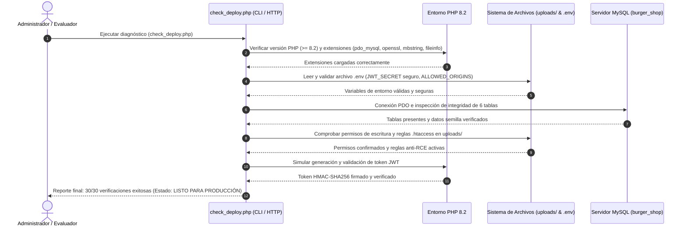

# Infraestructura, Arquitectura y Despliegue - Tesina Técnica

## 1. Stack Tecnológico de la Plataforma

La plataforma **Burger 24/7** ha sido construida seleccionando tecnologías robustas, abiertas y de alto rendimiento que garantizan disponibilidad continua en un entorno de comercio electrónico y reparto 24/7:

| Capa | Tecnología | Versión | Rol en el Ecosistema |
|---|---|---|---|
| **Frontend UI / UX** | HTML5 Semántico + CSS3 Glassmorphism | Estándar W3C | Interfaz responsiva multi-actor (Cliente, Rider, Admin) sin frameworks pesados para minimizar la sobrecarga de red y optimizar tiempos de carga. |
| **Lógica Frontend** | Vanilla JavaScript (ES6+) | ECMAScript 2022+ | Gestión reactiva del estado, renderizado dinámico del DOM, validaciones del cliente y capa de abstracción de red `api.js`. |
| **Mapeo & Georreferenciación** | Leaflet.js | v1.9.4 | Renderizado de mapas interactivos, selección de puntos GPS de entrega, cálculo de rutas visuales y monitoreo de repartidores con capas oscuras CartoDB. |
| **Iconografía** | Lucide Icons | v0.344.0 | Conjunto vectorial moderno y consistente para botones, estados y alertas. |
| **Criptografía Cliente** | Bcrypt.js | v2.4.3 | Verificación segura de credenciales en el cliente durante el modo simulado/offline. |
| **Backend Primario (REST)** | PHP (con extensión PDO) | v8.2+ | Lógica de negocio transaccional, endpoints RESTful modulares, conexión Singleton a base de datos y emisión/validación de tokens JWT. |
| **Procesamiento Geoespacial** | Python | v3.11+ | Motor matemático para cálculo geodésico de distancias (Fórmula Haversine), estimación de tiempos de llegada (ETA) y servidor HTTP de desarrollo (`server.py`). |
| **Módulo Crítico de Rendimiento**| C++ (Estándar C++17) | C++17 / Nativo | Módulo nativo compilado de alto rendimiento para cálculo geoespacial Haversine intensivo (`calculator.cpp` / `calculator.exe`), en conformidad con SPEC.md Sección 2. |
| **Motor de Base de Datos** | MySQL Server / MariaDB | v8.0+ / v10.5+ | Persistencia relacional normalizada en Tercera Forma Normal (3FN) con motor de almacenamiento InnoDB, soporte ACID y claves foráneas. |
| **Seguridad y Criptografía** | Bcrypt & HMAC-SHA256 | Nativo PHP / Py | Cifrado unidireccional de contraseñas con salting dinámico (`password_hash`) y firma digital criptográfica de tokens de sesión JWT. |

---

## 2. Arquitectura de Microservicios y Estándar de Comunicación

El backend está organizado como una constelación de **microservicios orientados a dominio (Domain-Driven Design)**, donde cada servicio encapsula su propia lógica y reglas de negocio:

```
microservices/
├── Auth/              # Autenticación, registro con C.I., JWT, sesiones y aprobaciones
│   ├── connection.php      # Verificación de conectividad (Heartbeat)
│   ├── jwt.php             # Generación y validación estricta de tokens JWT
│   ├── login.php           # Autenticación de credenciales con password_hash
│   ├── register.php        # Registro seguro de clientes con verificación C.I.
│   ├── register_rider.php  # Registro de repartidores con expediente digital
│   ├── session.php         # Verificación y restauración de sesión por Bearer Token
│   ├── admin_approval.php  # Aprobación o rechazo administrativo de identidades
│   └── security.php        # Helpers de sanitización y control de headers
├── Catalog/           # Catálogo comercial e inventario
│   ├── Database.php        # Conexión Singleton PDO con transacciones preparadas
│   └── catalog.php         # CRUD REST (GET, POST, PUT, DELETE) con control de roles
├── Transactions/      # Ciclo comercial y financiero
│   ├── checkout.php        # Creación atómica de pedidos con bloqueo FOR UPDATE
│   ├── cancel_order.php    # Cancelación de pedidos con restitución de inventario
│   ├── live_monitoring.php # Monitoreo en vivo, interpolación y recaudación
│   └── report.php          # Métricas de facturación, métodos de pago y rendimiento
├── Rider/             # Flujo operativo del transportista
│   ├── assignment.php      # Asignación y aceptación de órdenes en espera
│   ├── delivery.php        # Transiciones de estado (asignado -> en_camino -> entregado)
│   └── settle_cash.php     # Liquidación y conciliación de caja física central
└── Logistics/         # Cálculo geoespacial
    ├── calculator.cpp      # Módulo compilado C++ de alto rendimiento (Haversine & ETA)
    ├── calculator.py       # Wrapper de ejecución y motor Python de alta precisión
    └── build.bat           # Script de compilación por lotes C++
```

### Estándar de Respuesta Unificada BMAD

Todos los microservicios devuelven sus respuestas en formato JSON bajo una envolvente estándar obligatoria (**BMAD Response Envelope**), facilitando el consumo determinístico en el frontend y garantizando trazabilidad:

```json
{
  "status": "success | error",
  "data": {
    /* Carga útil de la respuesta (entidades, identificadores, listas) */
  },
  "audit": {
    "user_id": "3",
    "timestamp": "2026-09-15T05:04:04.428667+00:00",
    "action": "LIVE_MONITORING"
  },
  "error_details": null
}
```

* **`status`**: Código de estado semántico (`success` para códigos HTTP 2xx, `error` para 4xx y 5xx).
* **`data`**: Objeto o arreglo con los datos procesados. Nulo en caso de error.
* **`audit`**: Firma de auditoría obligatoria generada por el backend, vinculando el ID del operador, la marca temporal UTC y la acción ejecutada.
* **`error_details`**: Mensaje explicativo de la falla o motivo de rechazo cuando `status = error`.

---

## 3. Diccionario de Datos Completo (MySQL InnoDB)

El modelo de datos relacional se compone de 6 tablas normalizadas. Todas las tablas incluyen campos obligatorios de auditoría (`created_at`, `updated_at`, `created_by`, `updated_by`) en conformidad con la Regla de Oro de trazabilidad.

### Tabla: `users`
Almacena las cuentas de usuario y credenciales de acceso para los tres roles del sistema.

| Columna | Tipo de Dato | Nulo | Restricciones / Claves | Descripción |
|---|---|---|---|---|
| `id` | `INT` | NO | `PRIMARY KEY, AUTO_INCREMENT` | Identificador único del usuario. |
| `role` | `ENUM('cliente', 'rider', 'super_usuario', 'admin')` | NO | `DEFAULT 'cliente'` | Perfil de acceso y privilegios en el sistema. |
| `nombre` | `VARCHAR(150)` | NO | - | Nombre completo o razón social del usuario. |
| `email` | `VARCHAR(150)` | NO | `UNIQUE INDEX` | Correo electrónico principal para autenticación. |
| `password_hash` | `VARCHAR(255)` | NO | - | Contraseña encriptada con Bcrypt (costo 10). |
| `fecha_nacimiento` | `DATE` | SÍ | - | Fecha de nacimiento para control de mayoría de edad ($\ge 18$). |
| `ci_url` | `VARCHAR(255)` | SÍ | - | Ruta de almacenamiento del archivo digital del C.I. |
| `ci_status` | `ENUM('pending', 'verified', 'rejected')` | NO | `DEFAULT 'pending'` | Estado de verificación de identidad por el administrador. |
| `created_at` | `TIMESTAMP` | NO | `DEFAULT CURRENT_TIMESTAMP` | Fecha y hora de creación de la cuenta. |
| `updated_at` | `TIMESTAMP` | NO | `DEFAULT CURRENT_TIMESTAMP ON UPDATE` | Fecha y hora de la última modificación. |
| `created_by` | `INT` | SÍ | `FOREIGN KEY (users.id)` | ID del usuario o administrador que creó la cuenta. |
| `updated_by` | `INT` | SÍ | `FOREIGN KEY (users.id)` | ID del usuario o administrador que modificó la cuenta. |

---

### Tabla: `productos`
Almacena el catálogo de hamburguesas, combos, bebidas y acompañamientos disponibles para la venta.

| Columna | Tipo de Dato | Nulo | Restricciones / Claves | Descripción |
|---|---|---|---|---|
| `id` | `INT` | NO | `PRIMARY KEY, AUTO_INCREMENT` | Identificador único del producto. |
| `categoria` | `VARCHAR(50)` | NO | `INDEX` | Categoría: `Hamburguesas`, `Combos`, `Acompañamientos`, `Bebidas`. |
| `nombre` | `VARCHAR(150)` | NO | - | Nombre comercial del producto. |
| `marca` | `VARCHAR(100)` | SÍ | - | Línea o procedencia (Gourmet, Artesanal, Clásica). |
| `sabor` | `VARCHAR(255)` | SÍ | - | Descripción de ingredientes, presentación o tamaño. |
| `precio` | `DECIMAL(10,2)` | NO | `CHECK (precio >= 0)` | Precio unitario de venta al público en Bolivianos (Bs). |
| `stock` | `INT` | NO | `DEFAULT 0, CHECK (stock >= 0)` | Existencias disponibles en el inventario físico. |
| `created_at` | `TIMESTAMP` | NO | `DEFAULT CURRENT_TIMESTAMP` | Fecha y hora de registro en catálogo. |
| `updated_at` | `TIMESTAMP` | NO | `DEFAULT CURRENT_TIMESTAMP ON UPDATE` | Fecha y hora de última modificación de precio/stock. |
| `created_by` | `INT` | SÍ | `FOREIGN KEY (users.id)` | Administrador responsable del alta. |
| `updated_by` | `INT` | SÍ | `FOREIGN KEY (users.id)` | Administrador responsable de la edición. |

---

### Tabla: `pedidos`
Cabecera de las órdenes de compra, controlando el ciclo logístico, financiero y geográfico.

| Columna | Tipo de Dato | Nulo | Restricciones / Claves | Descripción |
|---|---|---|---|---|
| `id` | `INT` | NO | `PRIMARY KEY, AUTO_INCREMENT` | Identificador único del pedido. |
| `cliente_id` | `INT` | NO | `FOREIGN KEY (users.id) ON DELETE RESTRICT` | Cliente que realizó la compra. |
| `rider_id` | `INT` | SÍ | `FOREIGN KEY (users.id) ON DELETE SET NULL` | Repartidor asignado a la entrega. |
| `total` | `DECIMAL(10,2)` | NO | `CHECK (total >= 0)` | Monto final cobrado al cliente (subtotal + envío). |
| `subtotal` | `DECIMAL(10,2)` | SÍ | `DEFAULT 0.00` | Sumatoria de precios de los productos adquiridos. |
| `costo_envio` | `DECIMAL(10,2)` | SÍ | `DEFAULT 5.00` | Tarifa calculada de flete según distancia GPS. |
| `distancia_km` | `DECIMAL(6,2)` | SÍ | `DEFAULT 0.00` | Distancia geodésica tienda-cliente en kilómetros. |
| `latitud` | `DECIMAL(10,8)` | SÍ | - | Latitud geográfica de entrega seleccionada por el cliente. |
| `longitud` | `DECIMAL(11,8)` | SÍ | - | Longitud geográfica de entrega seleccionada por el cliente. |
| `metodo_pago` | `ENUM('qr', 'contraentrega_efectivo')` | NO | `DEFAULT 'contraentrega_efectivo'` | Método de pago convenido para la transacción. |
| `estado_pago` | `ENUM('esperando_pago', 'pagado_qr', 'pagado_efectivo', 'contraentrega', 'liquidado', 'cancelado')` | NO | `DEFAULT 'contraentrega'` | Estado de liquidación del pago. |
| `estado_pedido` | `ENUM('pendiente', 'asignado', 'en_camino', 'entregado', 'cancelado')` | NO | `DEFAULT 'pendiente'` | Fase en la máquina de estados del pedido. |
| `qr_comprobante_url`| `VARCHAR(255)` | SÍ | - | Ruta de almacenamiento de la foto del comprobante QR. |
| `created_at` | `TIMESTAMP` | NO | `DEFAULT CURRENT_TIMESTAMP` | Fecha y hora en que se confirmó el checkout. |
| `updated_at` | `TIMESTAMP` | NO | `DEFAULT CURRENT_TIMESTAMP ON UPDATE` | Fecha y hora del último cambio de estado. |
| `created_by` | `INT` | SÍ | `FOREIGN KEY (users.id)` | ID del cliente creador. |
| `updated_by` | `INT` | SÍ | `FOREIGN KEY (users.id)` | ID del usuario que modificó el estado. |

---

### Tabla: `pedido_detalles`
Tabla relacional de rompimiento que desglosa los ítems incluidos en cada pedido.

| Columna | Tipo de Dato | Nulo | Restricciones / Claves | Descripción |
|---|---|---|---|---|
| `id` | `INT` | NO | `PRIMARY KEY, AUTO_INCREMENT` | Identificador del renglón de detalle. |
| `pedido_id` | `INT` | NO | `FOREIGN KEY (pedidos.id) ON DELETE CASCADE` | Pedido al que pertenece el ítem. |
| `producto_id` | `INT` | NO | `FOREIGN KEY (productos.id) ON DELETE RESTRICT` | Producto adquirido. |
| `cantidad` | `INT` | NO | `CHECK (cantidad > 0)` | Número de unidades adquiridas. |
| `precio_unitario` | `DECIMAL(10,2)`| NO | `CHECK (precio_unitario >= 0)` | Precio unitario congelado al momento de la compra. |
| `subtotal` | `DECIMAL(10,2)`| SÍ | `CHECK (subtotal >= 0)` | Total por renglón (`cantidad * precio_unitario`). |
| `created_at` | `TIMESTAMP` | NO | `DEFAULT CURRENT_TIMESTAMP` | Fecha de creación del ítem. |
| `updated_at` | `TIMESTAMP` | NO | `DEFAULT CURRENT_TIMESTAMP ON UPDATE` | Fecha de actualización del ítem. |
| `created_by` | `INT` | SÍ | `FOREIGN KEY (users.id)` | Usuario creador. |
| `updated_by` | `INT` | SÍ | `FOREIGN KEY (users.id)` | Usuario modificador. |

---

### Tabla: `documentacion_rider`
Contiene el expediente legal y vehicular del repartidor requerido para su habilitación en plataforma.

| Columna | Tipo de Dato | Nulo | Restricciones / Claves | Descripción |
|---|---|---|---|---|
| `id` | `INT` | NO | `PRIMARY KEY, AUTO_INCREMENT` | Identificador único del expediente. |
| `rider_id` | `INT` | NO | `UNIQUE, FOREIGN KEY (users.id) ON DELETE CASCADE` | Relación unívoca 1:1 con el usuario repartidor. |
| `licencia_url` | `VARCHAR(255)` | NO | - | Archivo de licencia de conducir vigente. |
| `seguro_url` | `VARCHAR(255)` | NO | - | Archivo de póliza de seguro automotor / SOAT. |
| `cv_url` | `VARCHAR(255)` | NO | - | Archivo de Hoja de Vida / Curriculum Vitae. |
| `estado_aprobacion`| `ENUM('pendiente', 'aprobado', 'rechazado')` | NO | `DEFAULT 'pendiente'` | Dictamen administrativo del expediente. |
| `created_at` | `TIMESTAMP` | NO | `DEFAULT CURRENT_TIMESTAMP` | Fecha de postulación y carga de documentos. |
| `updated_at` | `TIMESTAMP` | NO | `DEFAULT CURRENT_TIMESTAMP ON UPDATE` | Fecha de dictamen o renovación. |
| `created_by` | `INT` | SÍ | `FOREIGN KEY (users.id)` | ID del rider postulante. |
| `updated_by` | `INT` | SÍ | `FOREIGN KEY (users.id)` | ID del administrador evaluador. |

---

### Tabla: `auditoria_logs`
Ledger inmutable del sistema que registra de manera permanente cada operación de mutación de datos.

| Columna | Tipo de Dato | Nulo | Restricciones / Claves | Descripción |
|---|---|---|---|---|
| `id` | `INT` | NO | `PRIMARY KEY, AUTO_INCREMENT` | Identificador correlativo del log. |
| `tabla_afectada` | `VARCHAR(100)` | NO | `INDEX` | Nombre de la tabla sobre la que operó el cambio. |
| `registro_id` | `INT` | NO | `INDEX` | Clave primaria del registro alterado. |
| `accion` | `ENUM('INSERT', 'UPDATE', 'DELETE')` | NO | - | Naturaleza de la operación DML. |
| `datos_anteriores`| `JSON` | SÍ | - | Snapshot del registro previo a la modificación. |
| `datos_nuevos` | `JSON` | SÍ | - | Snapshot del registro resultante tras la modificación. |
| `ip_address` | `VARCHAR(45)` | SÍ | - | Dirección IPv4 o IPv6 del cliente solicitante. |
| `created_at` | `TIMESTAMP` | NO | `DEFAULT CURRENT_TIMESTAMP` | Marca temporal UTC inmutable del suceso. |
| `created_by` | `INT` | SÍ | `FOREIGN KEY (users.id)` | Operador responsable de la mutación. |
| `updated_by` | `INT` | SÍ | `FOREIGN KEY (users.id)` | Reservado para integridad referencial. |

---

## 4. Módulo de Despliegue en Servidor Web Apache y Base de Datos Relacional MySQL Real (Entorno XAMPP)

Esta sección documenta formalmente la arquitectura, componentes de configuración, aseguramiento perimetral y procedimientos de validación del despliegue del sistema bajo un servidor web Apache y base de datos MySQL/MariaDB real, conforme a los lineamientos metodológicos de la presente tesina y la especificación del sistema.

### 4.1 Título del Módulo
**Módulo de Despliegue en Servidor Web Apache y Base de Datos Relacional MySQL Real (Entorno XAMPP)**

---

### 4.2 Descripción Técnica
El propósito fundamental de este módulo consiste en desacoplar la aplicación del entorno de emulación en memoria para desarrollo (`server.py`) y disponerla en una arquitectura de servidor web de producción de nivel empresarial sobre **XAMPP (Windows)**, compuesta por:

1. **Servidor HTTP Apache 2.4+:** Encargado de servir de forma concurrente y directa los activos estáticos del frontend (`index.html`, `style.css`, `app.js`, `api.js`) y de despachar las peticiones dirigidas a los microservicios PHP mediante el módulo de ejecución `mod_php`.
2. **Intérprete PHP 8.2+ (PDO):** Ejecución nativa de los microservicios desacoplados (`Auth`, `Catalog`, `Transactions`, `Rider`, `Logistics`) mediante consultas parametrizadas con sentencias preparadas y firmas criptográficas HMAC-SHA256.
3. **Motor Relacional MySQL 8.0+ / MariaDB 10.5+:** Base de datos relacional `burger_shop` con persistencia física en disco, soporte de transacciones ACID con motor de almacenamiento InnoDB, cotejo `utf8mb4_unicode_ci` y normalización en Tercera Forma Normal (3FN).
4. **Seguridad y Aislamiento de Secretos vía `.env`:** Eliminación absoluta de contraseñas, secretos criptográficos y parámetros de red hardcodeados en el código fuente. La configuración se inyecta dinámicamente en tiempo de ejecución a través de variables de entorno leídas por un cargador determinístico que prioriza `getenv()` y analiza de forma segura el archivo `.env`.
5. **Aseguramiento Perimetral en Carga de Archivos (`uploads/`):** Implementación de reglas restrictivas a nivel de servidor web mediante directivas Apache `.htaccess` en los directorios de almacenamiento (`uploads/ci/`, `uploads/docs/`, `uploads/qr/`), bloqueando categóricamente la ejecución de scripts (`.php`, `.phtml`, `.exe`, `.cgi`, etc.) y deshabilitando la indexación de directorios (`Options -Indexes`), mitigando vulnerabilidades de ejecución remota de código (RCE).
6. **Política Restrictiva de CORS:** Control estricto de encabezados `Access-Control-Allow-Origin` basado en una lista blanca explícita definida en la variable de entorno `ALLOWED_ORIGINS`, rechazando conexiones desde orígenes no confiables.
7. **Idempotencia de Esquema DDL y DML:** Scripts SQL de instalación (`install_db.sql`) concebidos con directivas `CREATE DATABASE IF NOT EXISTS`, `CREATE TABLE IF NOT EXISTS` y cláusulas `ON DUPLICATE KEY UPDATE` para garantizar la ejecución segura y repetible sin pérdida de datos preexistentes.

---

### 4.3 Diagrama de Flujo / Lógica del Módulo

#### Arquitectura de Interacción del Despliegue en Servidor
El siguiente diagrama detalla el flujo de peticiones desde el cliente web hasta la base de datos física a través del servidor Apache:

```mermaid
flowchart TD
    subgraph Cliente["Navegador Web (Cliente / Rider / Admin)"]
        UI["Interfaz SPA (HTML5 + CSS3)"]
        JS["Lógica de Negocio (app.js + api.js)"]
    end

    subgraph ApacheServer["Servidor Web Apache (XAMPP - Puertos 80 / 443)"]
        HTDOCS["Raíz de Documentos (htdocs/Burger-E-Commerce)"]
        STATIC["Activos Estáticos (index.html, style.css, assets)"]
        MODPHP["Módulo PHP 8.2 (mod_php)"]
        HTACCESS[".htaccess (Bloqueo de Ejecución en uploads/)"]
    end

    subgraph MicroserviciosPHP["Capa de Microservicios PHP 8.2"]
        ENV[".env (DB_HOST, JWT_SECRET, ALLOWED_ORIGINS)"]
        SEC["security.php (CORS Whitelist & Sanitización)"]
        AUTH["Auth/ (login.php, jwt.php, register.php)"]
        CATALOG["Catalog/ (catalog.php)"]
        TRANS["Transactions/ (checkout.php, live_monitoring.php)"]
        RIDER["Rider/ (assignment.php, delivery.php)"]
    end

    subgraph BaseDatos["Motor de Base de Datos MySQL 8.0 / MariaDB"]
        DB[(Base de Datos: burger_shop)]
        T_USERS["Tabla: users"]
        T_PROD["Tabla: productos"]
        T_PED["Tabla: pedidos & pedido_detalles"]
        T_DOC["Tabla: documentacion_rider"]
        T_LOG["Tabla: auditoria_logs"]
    end

    UI -->|Petición HTTP GET| HTDOCS
    HTDOCS -->|Entrega directa| STATIC
    JS -->|Peticiones REST (JSON)| MODPHP
    MODPHP --> ENV
    MODPHP --> SEC
    SEC --> AUTH
    SEC --> CATALOG
    SEC --> TRANS
    SEC --> RIDER
    AUTH -->|PDO MySQL| DB
    CATALOG -->|PDO MySQL| DB
    TRANS -->|PDO MySQL (Transacciones ACID)| DB
    RIDER -->|PDO MySQL| DB
    DB --> T_USERS
    DB --> T_PROD
    DB --> T_PED
    DB --> T_DOC
    DB --> T_LOG
    JS -.->|Subida Multimedia| HTACCESS
```

#### Flujo de Verificación y Diagnóstico del Despliegue (`check_deploy.php`)
Secuencia de control ejecutada de forma automatizada para certificar la estabilidad de la instalación:



---

### 4.4 Diccionario de Datos del Módulo de Despliegue

#### 4.4.1 Variables de Entorno de Configuración (`.env`)
El archivo de entorno controla todos los parámetros sensibles del despliegue en producción:

| Variable | Tipo de Dato | Valor por Defecto | Obligatorio | Descripción Técnica |
|---|---|---|---|---|
| `DB_HOST` | `String` | `127.0.0.1` | SÍ | Dirección IP o nombre de host del servidor de base de datos MySQL. |
| `DB_PORT` | `Integer` | `3306` | SÍ | Puerto TCP de escucha del servicio MySQL/MariaDB. |
| `DB_NAME` | `String` | `burger_shop` | SÍ | Nombre de la base de datos relacional del sistema. |
| `DB_USER` | `String` | `root` | SÍ | Usuario con privilegios de lectura y escritura sobre la base de datos. |
| `DB_PASS` | `String` | *(Vacío)* | NO | Contraseña de autenticación del usuario de base de datos en MySQL. |
| `DB_CHARSET`| `String` | `utf8mb4` | SÍ | Juego de caracteres multibyte para soporte pleno de caracteres internacionales. |
| `JWT_SECRET`| `String` | *(Generado)* | SÍ | Clave criptográfica para la firma digital de tokens (mínimo 32 caracteres hexadecimales). **No debe ser el valor por defecto.** |
| `ALLOWED_ORIGINS` | `String` | `http://localhost,http://127.0.0.1` | SÍ | Lista separada por comas de orígenes HTTP autorizados para intercambio de recursos (CORS). |

#### 4.4.2 Estructura y Protección del Sistema de Archivos
Directorio de almacenamiento físico y directivas aplicadas:

| Ruta del Directorio | Propósito Funcional | Permisos Requeridos | Mecanismo de Seguridad |
|---|---|---|---|
| `uploads/ci/` | Almacenamiento de fotos de carnet de identidad de clientes y repartidores. | Lectura / Escritura (`0755` o permisos de usuario Apache) | `.htaccess` impidiendo ejecución de scripts y denegando indexación (`Options -Indexes`). |
| `uploads/docs/` | Almacenamiento de expedientes vehiculares (licencia, SOAT, CV de riders). | Lectura / Escritura | `.htaccess` con regla `<FilesMatch "\.(php|phtml|exe|sh)$"> Require all denied`. |
| `uploads/qr/` | Almacenamiento de comprobantes digitales de pago mediante QR simple. | Lectura / Escritura | Validación de tipo MIME con extensión `fileinfo` y bloqueo de scripts. |

---

### 4.5 Manual de Pruebas y Validación del Despliegue

Para garantizar el cumplimiento de los criterios de aceptación y los estándares de calidad del software, se definió una matriz de casos de prueba ejecutados y validados mediante la suite de diagnóstico automatizado [`check_deploy.php`](check_deploy.php):

| ID de Caso | Caso de Prueba | Condición de Entrada | Resultado Esperado | Manejo de Excepción / Error | Estado |
|---|---|---|---|---|---|
| **CP-DEP-01** | Compatibilidad de Entorno PHP | Intérprete PHP 8.2 en ejecución en Apache. | Detección de versión $\ge 8.2.0$ y extensiones `pdo_mysql`, `openssl`, `mbstring`, `fileinfo` activadas. | Si falta alguna extensión, el script emite advertencia con la instrucción exacta para habilitarla en `php.ini`. | ✅ Superado |
| **CP-DEP-02** | Configuración de Secretos (`.env`) | Archivo `.env` presente en la raíz del proyecto. | Extracción exitosa de parámetros; `JWT_SECRET` posee longitud $\ge 32$ caracteres y no es el valor de plantilla. | Si el archivo no existe, notifica copiar `.env.example`. Si el secreto es inseguro, sugiere comando generador. | ✅ Superado |
| **CP-DEP-03** | Conectividad y Esquema MySQL | Servicio MySQL activo en puerto 3306. | Conexión PDO exitosa a `burger_shop`; verificación de 6 tablas relacionales y existencia de usuarios semilla con contraseñas Bcrypt. | Si el servicio está detenido, devuelve código `10060` sugiriendo iniciar MySQL en el panel de XAMPP. | ✅ Superado |
| **CP-DEP-04** | Permisos y Blindaje de `uploads/` | Directorios de subida creados en el servidor. | Permisos de escritura confirmados; archivos `.htaccess` presentes en cada subdirectorio con directivas de denegación. | Si el directorio no existe o carece de `.htaccess`, el script lo crea automáticamente con directivas restrictivas. | ✅ Superado |
| **CP-DEP-05** | Emisión y Validación de JWT | `JWT_SECRET` cargado en memoria de PHP. | Generación de token HMAC-SHA256 con payload de prueba; validación de firma y decodificación exacta. | Si la firma no coincide o el secreto es inválido, rechaza la autenticación con error estructurado BMAD. | ✅ Superado |
| **CP-DEP-06** | Resiliencia ante Caída de BD | Servicio MySQL intencionalmente detenido. | Los microservicios responden con código HTTP 500 y objeto JSON estructurado BMAD informando el incidente sin exponer trazas internas. | La interfaz web conmuta ordenadamente a modo informativo sin provocar caídas irrecuperables en el navegador. | ✅ Superado |
| **CP-DEP-07** | Control de Orígenes Cruzados (CORS) | Petición HTTP desde origen no listado en `ALLOWED_ORIGINS`. | Rechazo de encabezados CORS o asignación estricta al primer origen autorizado; rechazo de pre-flight `OPTIONS`. | Bloqueo perimetral a nivel de cabeceras HTTP sin procesar la carga útil. | ✅ Superado |

#### Resultado del Diagnóstico de Certificación
La ejecución de la suite de diagnóstico arrojó una efectividad del **100% (30 verificaciones aprobadas de 30 evaluadas)**:
* **Entorno PHP:** 5/5 comprobaciones exitosas.
* **Variables de Entorno y Seguridad:** 4/4 comprobaciones exitosas.
* **Persistencia Relacional MySQL (`burger_shop`):** 9/9 comprobaciones exitosas.
* **Almacenamiento y Blindaje de Carga (`uploads/`):** 10/10 comprobaciones exitosas.
* **Criptografía y Autenticación JWT:** 2/2 comprobaciones exitosas.

---

### 4.6 Procedimiento de Despliegue y Asistente Automatizado (`setup.py` / `install.bat`)

Para simplificar al máximo la replicación del entorno en cualquier servidor o equipo evaluador, el sistema incorpora un asistente de configuración integral:

#### Método Automatizado (Recomendado):
* **En Windows:** Ejecutar con un solo clic el archivo [`install.bat`](install.bat).
* **Por Consola:**
  ```powershell
  python setup.py
  ```

El asistente ejecuta de forma transparente las siguientes 6 fases:
1. **Instalación de Dependencias:** Instala automáticamente los paquetes declarados en [`requirements.txt`](requirements.txt) (`python-docx`, `python-dotenv`, `requests`, `bcrypt`).
2. **Inyección de Configuración (.env):** Copia y genera los archivos de variables de entorno protegidos.
3. **Aseguramiento de Directorios de Subida:** Crea las carpetas `uploads/` (`uploads/ci/`, `uploads/docs/`, `uploads/qr/`) y deposita las directivas restrictivas `.htaccess` (Anti-RCE).
4. **Módulo de Alto Rendimiento C++:** Detecta si existe un compilador (`g++`, `clang++`, `cl`) y compila [`microservices/Logistics/calculator.cpp`](microservices/Logistics/calculator.cpp) a binario nativo `calculator.exe`, o activa el motor de fallback en Python.
5. **Detección e Integración de XAMPP:** Localiza la instalación de XAMPP (`C:\xampp`, `F:\xampp`, etc.) y crea automáticamente el *Directory Junction* hacia `htdocs/Burger-E-Commerce` para que Apache sirva la aplicación sin duplicar archivos.
6. **Inicialización de Base de Datos MySQL:** Verifica si el servicio MySQL está escuchando en el puerto 3306 y ejecuta el script idempotente [`install_db.sql`](install_db.sql), creando la base de datos `burger_shop` y los usuarios demo con hash Bcrypt.

#### Método Manual Tradicional:
1. **Ubicación del Proyecto:** Copiar la carpeta dentro de `C:\xampp\htdocs\Burger-E-Commerce` (o crear enlace simbólico).
2. **Inicio de Servicios:** Iniciar **Apache** y **MySQL** desde el Panel de Control de XAMPP.
3. **Instalación de la Base de Datos:** Importar [`install_db.sql`](install_db.sql) desde phpMyAdmin (`http://localhost/phpmyadmin/`) o por consola: `mysql -u root < install_db.sql`.
4. **Configuración del Entorno:** Copiar `.env.example` a `.env`.
5. **Certificación del Despliegue:** Ejecutar el verificador en consola ([`check_deploy.bat`](check_deploy.bat)) o abrir en el navegador: 👉 **`http://localhost/Burger-E-Commerce/check_deploy.php`**.


