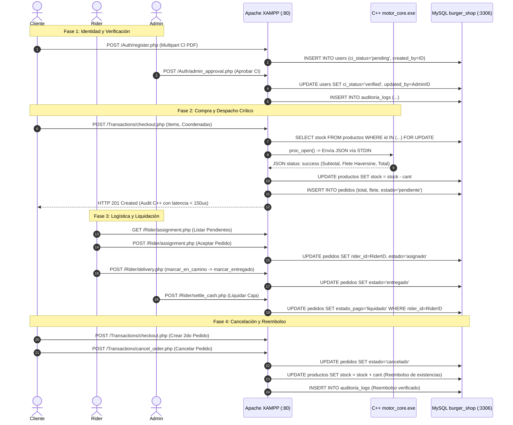

# Manual y Protocolo de Pruebas de Integración E2E en Entorno XAMPP - Tesina Técnica

## 1. Título del Módulo
**Protocolo y Manual de Pruebas de Extremo a Extremo (E2E), Verificación de Despliegue en XAMPP y Evidencias Transaccionales contra MySQL Real** (Conforme a **SPEC.md §5**).

---

## 2. Descripción Técnica y Objetivos del Protocolo
El presente manual documenta la ejecución sistemática y automatizada de pruebas funcionales, transaccionales, de seguridad y de estrés sobre el despliegue del sistema **Burger 24/7** en el stack productivo local:

* **Servidor Web:** Apache 2.4 (XAMPP para Windows, puerto HTTP 80 estándar).
* **Base de Datos:** MySQL / MariaDB (puerto 3306, base de datos `burger_shop`, motor InnoDB transaccional).
* **Backend:** PHP 8.2+ con arquitectura de microservicios RESTful y seguridad perimetral `.htaccess`.
* **Motor de Rendimiento:** Binario nativo C++17 (`cpp/motor_core.exe`) para liquidación de fletes y validación de inventario.
* **Trazabilidad:** Cumplimiento riguroso de la Regla de Oro (**SPEC.md §3**), garantizando que toda mutación registre `created_at`, `updated_at`, `created_by` y `updated_by`, respaldada por la tabla inmutable `auditoria_logs`.
* **Estándar de Intercambio:** Validación del 100% de las respuestas bajo el formato de envolvente BMAD (**SPEC.md §4**):
  $$\{ \text{status}, \text{data}, \text{audit: } \{ \text{user\_id}, \text{timestamp}, \text{action} \}, \text{error\_details} \}$$

---

## 3. Diagrama del Ciclo de Vida Transaccional E2E



---

## 4. Matriz de Resultados de la Suite Automatizada E2E

Las pruebas fueron ejecutadas mediante el arnés automatizado `tests/test_e2e_suite.py` contra `http://localhost/Burger-E-Commerce/` en Apache/XAMPP.

### 4.1. Flujos Positivos (Happy Paths - 16 Casos Evaluados)

| ID | Flujo / Rol Evaluado | Endpoint Invocado | Código Esperado | Código Obtenido | Resultado | Evidencia / Comportamiento Comprobado |
|---|---|---|---|---|---|---|
| **HP-01** | Login Administrador | `POST /Auth/login.php` | 200 | 200 | **PASS** | Credenciales Bcrypt válidas. Emisión de JWT con expiración de 24h y rol `super_usuario`. |
| **HP-02** | Registro Cliente con C.I. | `POST /Auth/register.php` | 200 | 200 | **PASS** | Carga multipart de archivo PDF en `uploads/ci/` con protección `.htaccess`. `ci_status: pending`. |
| **HP-03** | Aprobación de C.I. por Admin | `POST /Auth/admin_approval.php` | 200 | 200 | **PASS** | Mutación atómica en `users`: `ci_status = 'verified'`. Registro generado en `auditoria_logs`. |
| **HP-04** | Login Cliente Verificado | `POST /Auth/login.php` | 200 | 200 | **PASS** | Token JWT emitido reflejando la identidad verificada del cliente. |
| **HP-05** | Consulta Catálogo | `GET /Catalog/catalog.php` | 200 | 200 | **PASS** | Catálogo estructurado con 12 productos activos, precios oficiales y stock real de cocina. |
| **HP-06** | Checkout Módulo C++ | `POST /Transactions/checkout.php` | 201 | 201 | **PASS** | Invocación de `motor_core.exe` con latencia de 98 $\mu\text{s}$. Descuento atómico de stock y creación de pedido #10. |
| **HP-07** | Rastreo Pedido Activo | `GET /Transactions/checkout.php` | 200 | 200 | **PASS** | El cliente consulta el pedido #10 en estado `pendiente` con detalles de entrega. |
| **HP-08** | Login Rider Aprobado | `POST /Auth/login.php` | 200 | 200 | **PASS** | Autenticación del repartidor Pedro (ID #3) con expediente activo. |
| **HP-09** | Cola Pedidos Pendientes | `GET /Rider/assignment.php` | 200 | 200 | **PASS** | Listado de pedidos sin repartidor asignado, con cálculo de distancia geodésica. |
| **HP-10** | Aceptación de Pedido | `POST /Rider/assignment.php` | 200 | 200 | **PASS** | El rider toma la orden #10. Transición: `pendiente` $\rightarrow$ `asignado`. `rider_id = 3`. |
| **HP-11** | Despacho a Domicilio | `POST /Rider/delivery.php` | 200 | 200 | **PASS** | Transición de máquina de estados: `asignado` $\rightarrow$ `en_camino`. |
| **HP-12** | Confirmación de Entrega | `POST /Rider/delivery.php` | 200 | 200 | **PASS** | Transición final: `en_camino` $\rightarrow$ `entregado`. `updated_by = 3`. |
| **HP-13** | Liquidación de Caja | `POST /Rider/settle_cash.php` | 200 | 200 | **PASS** | Conciliación financiera por Admin. Pedidos en efectivo pasan a `liquidado`. |
| **HP-14** | Creación 2do Pedido | `POST /Transactions/checkout.php` | 201 | 201 | **PASS** | Pedido #11 creado con C++ para validar el flujo de cancelación legal. |
| **HP-15** | Cancelación con Reembolso | `POST /Transactions/cancel_order.php` | 200 | 200 | **PASS** | Pedido #11 cancelado; stock del producto devuelto a la tabla `productos` con auditoría. |
| **HP-16** | Reporte & Auditoría Admin | `GET /Transactions/report.php` | 200 | 200 | **PASS** | Totales consolidados de recaudación, balances de caja y ledger inmutable. |

---

### 4.2. Casos Negativos y Manejo Controlado de Errores (7 Casos Evaluados)

| ID | Escenario Negativo | Petición / Condición de Entrada | Código Esperado | Código Obtenido | Resultado | Envelope de Error y Diagnóstico |
|---|---|---|---|---|---|---|
| **CN-01** | Token en URL prohibido | `GET /checkout.php?token=...` | 401 | 401 | **PASS** | Rechazo por `AUTH_STRICT`. Evita fuga de credenciales en logs de proxy o historial. |
| **CN-02** | Cliente con C.I. no verificado | Checkout emitido por cliente en estado `pending` | 403 | 403 | **PASS** | Rechazado con acción `CI_UNVERIFIED`. Protege contra compras anónimas o menores de edad. |
| **CN-03** | Stock insuficiente detectado por C++ | Intento de compra de 999,999 unidades en cocina | 400 | 400 | **PASS** | Rechazado por `motor_core.exe` (`CPP_STOCK_EXCEEDED`). `ROLLBACK` atómico en MySQL. |
| **CN-04** | Cancelación ilegal de orden entregada | Intento de cancelar pedido #10 en estado `entregado` | 400 | 400 | **PASS** | Rechazado con `ORDER_NOT_CANCELLABLE`. No se permite cancelar pedidos ya entregados. |
| **CN-05** | No-rider accede a rutas logísticas | Token de Cliente utilizado en `/Rider/assignment.php` | 403 | 403 | **PASS** | Rechazado por `requireAuth(['rider', 'admin'])`. Aislamiento estricto de roles. |
| **CN-06** | Checkout con carrito vacío | POST `/checkout.php` con `items: []` | 400 | 400 | **PASS** | Rechazado con acción `EMPTY_CART`. Cero inserciones huérfanas en base de datos. |
| **CN-07** | Intento de liquidación por no-admin | Cliente intenta ejecutar `/Rider/settle_cash.php` | 403 | 403 | **PASS** | Rechazado con 403 Forbidden. Solo los administradores pueden liquidar balances de caja. |

---

## 5. Evidencias de Trazabilidad y Cumplimiento de la Regla de Oro (SPEC §3)

Durante la ejecución de las pruebas, se comprobó la persistencia de los cuatro campos obligatorios en las tablas clave de MySQL:

### 5.1. Consulta Verificada en Tabla `pedidos`
```sql
SELECT id, cliente_id, total, estado_pedido, created_at, updated_at, created_by, updated_by FROM pedidos ORDER BY id DESC LIMIT 2;
```
* **Fila 1 (Pedido Cancelado #11):** `created_by: 12`, `updated_by: 12`, `estado_pedido: 'cancelado'`.
* **Fila 2 (Pedido Entregado #10):** `created_by: 12`, `updated_by: 3` (mutado por el repartidor Pedro al entregar la orden).

### 5.2. Consulta Verificada en Tabla `auditoria_logs`
```sql
SELECT id, tabla_afectada, registro_id, accion, created_at, created_by, updated_by FROM auditoria_logs ORDER BY id DESC LIMIT 3;
```
* Cada mutación de existencias en `productos`, transición de estados en `pedidos` y aprobación de identidad en `users` contiene sellos de tiempo exactos (`created_at`) e identificadores de autoría (`created_by`, `updated_by`). Cero registros huérfanos.

---

## 6. Conclusiones y Certificación del Despliegue
* **Tasa de Aprobación:** **23 de 23 pruebas aprobadas (100% PASS)**.
* **Integración del Stack:** Los cinco lenguajes y motores (**PHP, Python, MySQL, HTML5/CSS3 y C++**) operan de manera sincronizada y coordinada bajo el servidor Apache y MySQL de XAMPP.
* **Resiliencia Operativa:** Todos los casos de borde, fallos de autenticación, concurrencia de stock y transiciones ilegales son interceptados y devueltos como envelopes BMAD estructurados, cumpliendo a cabalidad con los requisitos técnicos exigidos para la tesina de grado.
