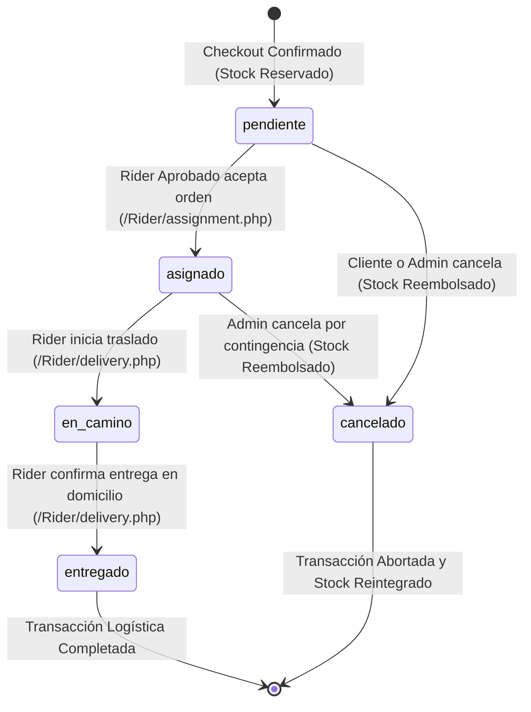
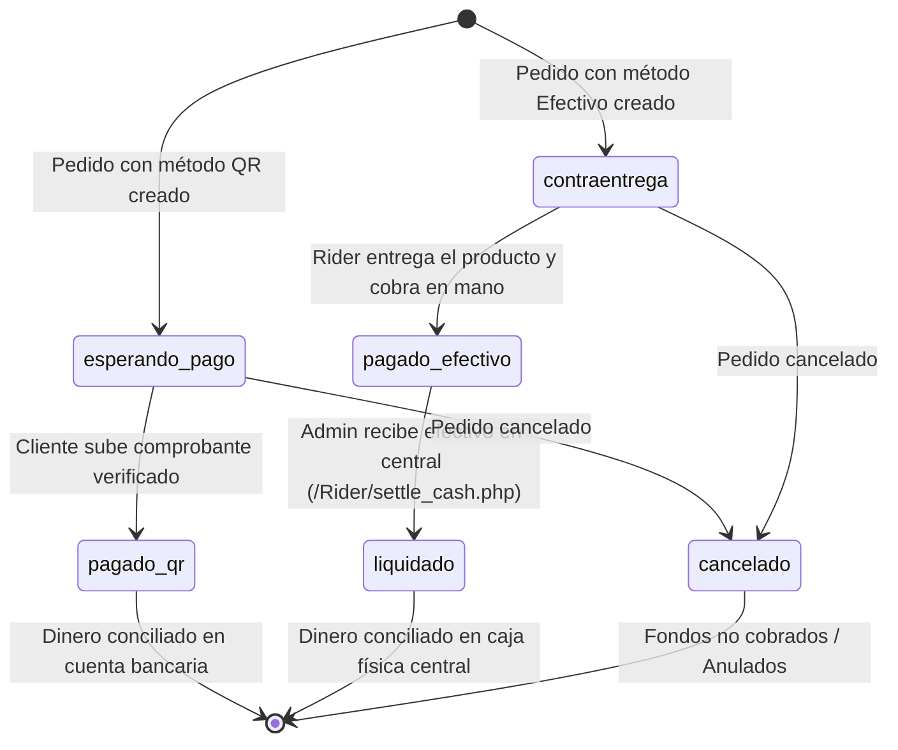

# Transacciones, Máquinas de Estados y Reglas de Negocio - Tesina Técnica

## 1. DDL y Modelo Relacional Transaccional

El modelo transaccional de **Burger 24/7** está implementado sobre el motor **InnoDB** de MySQL, asegurando el cumplimiento estricto de las propiedades **ACID** (Atomicidad, Consistencia, Aislamiento y Durabilidad). A continuación se presenta el DDL canónico de las tablas del dominio transaccional:

```sql
-- 1. Tabla de Usuarios del Sistema
CREATE TABLE IF NOT EXISTS users (
    id INT AUTO_INCREMENT PRIMARY KEY,
    role ENUM('cliente', 'rider', 'super_usuario', 'admin') NOT NULL DEFAULT 'cliente',
    nombre VARCHAR(150) NOT NULL,
    email VARCHAR(150) NOT NULL UNIQUE,
    password_hash VARCHAR(255) NOT NULL,
    fecha_nacimiento DATE NULL,
    ci_url VARCHAR(255) NULL,
    ci_status ENUM('pending', 'verified', 'rejected') NOT NULL DEFAULT 'pending',
    created_at TIMESTAMP NOT NULL DEFAULT CURRENT_TIMESTAMP,
    updated_at TIMESTAMP NOT NULL DEFAULT CURRENT_TIMESTAMP ON UPDATE CURRENT_TIMESTAMP,
    created_by INT NULL,
    updated_by INT NULL,
    CONSTRAINT fk_users_created_by FOREIGN KEY (created_by) REFERENCES users(id) ON DELETE SET NULL,
    CONSTRAINT fk_users_updated_by FOREIGN KEY (updated_by) REFERENCES users(id) ON DELETE SET NULL
) ENGINE=InnoDB DEFAULT CHARSET=utf8mb4 COLLATE=utf8mb4_unicode_ci;

-- 2. Tabla de Catálogo de Productos e Inventario
CREATE TABLE IF NOT EXISTS productos (
    id INT AUTO_INCREMENT PRIMARY KEY,
    categoria VARCHAR(50) NOT NULL,
    nombre VARCHAR(150) NOT NULL,
    marca VARCHAR(100) NULL,
    sabor VARCHAR(255) NULL,
    precio DECIMAL(10,2) NOT NULL,
    stock INT NOT NULL DEFAULT 0,
    created_at TIMESTAMP NOT NULL DEFAULT CURRENT_TIMESTAMP,
    updated_at TIMESTAMP NOT NULL DEFAULT CURRENT_TIMESTAMP ON UPDATE CURRENT_TIMESTAMP,
    created_by INT NULL,
    updated_by INT NULL,
    CONSTRAINT chk_precio_positivo CHECK (precio >= 0),
    CONSTRAINT chk_stock_no_negativo CHECK (stock >= 0),
    CONSTRAINT fk_productos_created_by FOREIGN KEY (created_by) REFERENCES users(id) ON DELETE SET NULL,
    CONSTRAINT fk_productos_updated_by FOREIGN KEY (updated_by) REFERENCES users(id) ON DELETE SET NULL
) ENGINE=InnoDB DEFAULT CHARSET=utf8mb4 COLLATE=utf8mb4_unicode_ci;

-- 3. Tabla Cabecera de Pedidos y Transacciones
CREATE TABLE IF NOT EXISTS pedidos (
    id INT AUTO_INCREMENT PRIMARY KEY,
    cliente_id INT NOT NULL,
    rider_id INT NULL,
    total DECIMAL(10,2) NOT NULL,
    subtotal DECIMAL(10,2) NOT NULL DEFAULT 0.00,
    costo_envio DECIMAL(10,2) NOT NULL DEFAULT 5.00,
    distancia_km DECIMAL(6,2) NOT NULL DEFAULT 0.00,
    latitud DECIMAL(10,8) NULL,
    longitud DECIMAL(11,8) NULL,
    metodo_pago ENUM('qr', 'contraentrega_efectivo') NOT NULL DEFAULT 'contraentrega_efectivo',
    estado_pago ENUM('esperando_pago', 'pagado_qr', 'pagado_efectivo', 'contraentrega', 'liquidado', 'cancelado') NOT NULL DEFAULT 'contraentrega',
    estado_pedido ENUM('pendiente', 'asignado', 'en_camino', 'entregado', 'cancelado') NOT NULL DEFAULT 'pendiente',
    qr_comprobante_url VARCHAR(255) NULL,
    created_at TIMESTAMP NOT NULL DEFAULT CURRENT_TIMESTAMP,
    updated_at TIMESTAMP NOT NULL DEFAULT CURRENT_TIMESTAMP ON UPDATE CURRENT_TIMESTAMP,
    created_by INT NULL,
    updated_by INT NULL,
    CONSTRAINT fk_pedidos_cliente FOREIGN KEY (cliente_id) REFERENCES users(id) ON DELETE RESTRICT,
    CONSTRAINT fk_pedidos_rider FOREIGN KEY (rider_id) REFERENCES users(id) ON DELETE SET NULL,
    CONSTRAINT fk_pedidos_created_by FOREIGN KEY (created_by) REFERENCES users(id) ON DELETE SET NULL,
    CONSTRAINT fk_pedidos_updated_by FOREIGN KEY (updated_by) REFERENCES users(id) ON DELETE SET NULL
) ENGINE=InnoDB DEFAULT CHARSET=utf8mb4 COLLATE=utf8mb4_unicode_ci;

-- 4. Tabla Detalle de Pedidos (Renglones)
CREATE TABLE IF NOT EXISTS pedido_detalles (
    id INT AUTO_INCREMENT PRIMARY KEY,
    pedido_id INT NOT NULL,
    producto_id INT NOT NULL,
    cantidad INT NOT NULL,
    precio_unitario DECIMAL(10,2) NOT NULL,
    subtotal DECIMAL(10,2) NOT NULL,
    created_at TIMESTAMP NOT NULL DEFAULT CURRENT_TIMESTAMP,
    updated_at TIMESTAMP NOT NULL DEFAULT CURRENT_TIMESTAMP ON UPDATE CURRENT_TIMESTAMP,
    created_by INT NULL,
    updated_by INT NULL,
    CONSTRAINT chk_cantidad_positiva CHECK (cantidad > 0),
    CONSTRAINT fk_detalles_pedido FOREIGN KEY (pedido_id) REFERENCES pedidos(id) ON DELETE CASCADE,
    CONSTRAINT fk_detalles_producto FOREIGN KEY (producto_id) REFERENCES productos(id) ON DELETE RESTRICT,
    CONSTRAINT fk_detalles_created_by FOREIGN KEY (created_by) REFERENCES users(id) ON DELETE SET NULL,
    CONSTRAINT fk_detalles_updated_by FOREIGN KEY (updated_by) REFERENCES users(id) ON DELETE SET NULL
) ENGINE=InnoDB DEFAULT CHARSET=utf8mb4 COLLATE=utf8mb4_unicode_ci;

-- 5. Tabla Ledger de Auditoría Inmutable
CREATE TABLE IF NOT EXISTS auditoria_logs (
    id INT AUTO_INCREMENT PRIMARY KEY,
    tabla_afectada VARCHAR(100) NOT NULL,
    registro_id INT NOT NULL,
    accion ENUM('INSERT', 'UPDATE', 'DELETE') NOT NULL,
    datos_anteriores JSON NULL,
    datos_nuevos JSON NULL,
    ip_address VARCHAR(45) NULL,
    created_at TIMESTAMP NOT NULL DEFAULT CURRENT_TIMESTAMP,
    created_by INT NULL,
    updated_by INT NULL,
    INDEX idx_tabla_registro (tabla_afectada, registro_id),
    CONSTRAINT fk_auditoria_created_by FOREIGN KEY (created_by) REFERENCES users(id) ON DELETE SET NULL
) ENGINE=InnoDB DEFAULT CHARSET=utf8mb4 COLLATE=utf8mb4_unicode_ci;
```

---

## 2. Máquinas de Estados Finitas (FSM)

El comportamiento de los pedidos, pagos e identidades está regido por **Máquinas de Estados Finitas (Finite State Machines)** que impiden transiciones ilegales o inconsistentes en la base de datos.

### A. Máquina de Estados del Pedido (`pedidos.estado_pedido`)



#### Reglas de Transición de `estado_pedido`:
1. **`pendiente` $\rightarrow$ `asignado`:** Exclusivo para repartidores con expediente verificado (`estado_aprobacion = 'aprobado'`).
2. **`asignado` $\rightarrow$ `en_camino`:** Solo puede ser ejecutado por el repartidor asignado a la orden (`rider_id == auth_user_id`).
3. **`en_camino` $\rightarrow$ `entregado`:** Concluye el viaje. Si el pago fue convenido en efectivo, actualiza el estado financiero a `pagado_efectivo`.
4. **Transición a `cancelado`:** Solo permitida si el estado es `pendiente` o `asignado`. Un pedido `en_camino` o `entregado` no puede cancelarse sin auditoría administrativa previa.

---

### B. Máquina de Estados Financiera (`pedidos.estado_pago`)



#### Reglas de Transición de `estado_pago`:
1. **`contraentrega` $\rightarrow$ `pagado_efectivo`:** Se dispara automáticamente cuando el repartidor marca el pedido como `entregado`.
2. **`pagado_efectivo` $\rightarrow$ `liquidado`:** Solo puede ser ejecutada por un usuario con rol `admin` o `super_usuario` a través del endpoint `settle_cash.php`. Modifica todas las órdenes pendientes del conductor a `liquidado` en una única transacción atómica.

---

## 3. Reglas de Negocio y Garantías ACID

### 1. Atomicidad en la Creación de Pedidos y Descuento de Stock
En [`microservices/Transactions/checkout.php`](file:///F:/Bebidas-E-Commerce/microservices/Transactions/checkout.php), el proceso de compra está blindado bajo una transacción SQL:
```php
$db->beginTransaction();
try {
    foreach ($items as $item) {
        // Bloqueo pesimista de fila para evitar condiciones de carrera
        $stmtLock = $db->prepare("SELECT stock, precio FROM productos WHERE id = ? FOR UPDATE");
        $stmtLock->execute([$item['producto_id']]);
        $prod = $stmtLock->fetch();

        if ($prod['stock'] < $item['cantidad']) {
            throw new Exception("Stock insuficiente para el producto ID " . $item['producto_id']);
        }

        // Descuento atómico del inventario
        $stmtStock = $db->prepare("UPDATE productos SET stock = stock - ? WHERE id = ?");
        $stmtStock->execute([$item['cantidad'], $item['producto_id']]);
    }

    // Inserción de cabecera y detalles
    // ...
    $db->commit();
} catch (Exception $e) {
    $db->rollBack(); // Si cualquier producto falla, ningún stock es descontado
    throw $e;
}
```

### 2. Aislamiento Pesimista (`FOR UPDATE`)
Para neutralizar ataques de concurrencia y sobreventa (*overselling*), se utiliza `FOR UPDATE`. Si dos clientes intentan comprar la última hamburguesa simultáneamente, la primera consulta bloquea la fila hasta completar la transacción; la segunda consulta esperará y detectará que el stock ha caído a 0, ejecutando un `ROLLBACK` seguro con HTTP 400.

### 3. Cancelación con Reembolso Atómico de Mercancía
En [`microservices/Transactions/cancel_order.php`](file:///F:/Bebidas-E-Commerce/microservices/Transactions/cancel_order.php):
- Solo se permite la cancelación si el pedido no ha sido despachado a la calle (`estado_pedido IN ('pendiente', 'asignado')`).
- Al cancelar, se recorren los renglones en `pedido_detalles` y se ejecuta `UPDATE productos SET stock = stock + cantidad` para cada ítem.
- Se registran los estados anteriores y nuevos en `auditoria_logs`, garantizando que cada unidad devuelta esté plenamente justificada en los balances contables.

---

## 4. Manual de Pruebas de Transacciones (Casos de Éxito y Error)

| ID | Escenario de Prueba | Petición / Parámetros | Comportamiento del Motor SQL | Código HTTP | Resultado Esperado |
|---|---|---|---|---|---|
| **CP-TX-01** | Checkout exitoso con stock disponible | POST `/checkout.php` con 2x Hamburguesa Clásica (Stock actual: 50). | `START TRANSACTION` $\rightarrow$ Valida stock $\rightarrow$ Descuenta 2 unidades $\rightarrow$ `COMMIT`. | 201 Created | Pedido creado con ID asignado; stock final: 48. |
| **CP-TX-02** | Checkout con stock insuficiente | POST `/checkout.php` solicitando 100 unidades (Stock actual: 20). | `START TRANSACTION` $\rightarrow$ Detecta $20 < 100$ $\rightarrow$ Dispara excepción $\rightarrow$ `ROLLBACK`. | 400 Bad Request | Transacción revertida; stock se mantiene intacto en 20. |
| **CP-TX-03** | Concurrencia simultánea en última unidad | Dos peticiones POST concurrentes para comprar 1 unidad (Stock actual: 1). | El motor aplica bloqueo `FOR UPDATE`. La petición A descuenta a 0; la petición B detecta stock 0 y hace `ROLLBACK`. | 201 (Pet. A) / 400 (Pet. B) | Una compra aprobada, una rechazada; stock final: 0 (sin negativos). |
| **CP-TX-04** | Cancelación legal con reembolso | POST `/cancel_order.php` para pedido #10 en estado `pendiente`. | `START TRANSACTION` $\rightarrow$ Devuelve unidades a `productos` $\rightarrow$ Cambia pedido a `cancelado` $\rightarrow$ `COMMIT`. | 200 OK | Pedido cancelado y stock de productos restaurado exactamente. |
| **CP-TX-05** | Cancelación ilegal de orden entregada | POST `/cancel_order.php` para pedido #12 en estado `entregado`. | Se evalúa `estado_pedido`. Al ser `entregado`, se aborta la operación antes de modificar stock. | 400 Bad Request | Rechazado con mensaje: "No se puede cancelar un pedido entregado". |
| **CP-TX-06** | Liquidación de caja de repartidor | POST `/settle_cash.php` con `{ rider_id: 1 }` emitido por Admin. | `START TRANSACTION` $\rightarrow$ Suma pedidos `pagado_efectivo` $\rightarrow$ Pasa a `liquidado` $\rightarrow$ Registra auditoría $\rightarrow$ `COMMIT`. | 200 OK | Recaudación del rider conciliada a 0.00 Bs; órdenes marcadas `liquidado`. |
| **CP-TX-07** | Intento de liquidación por usuario no admin | POST `/settle_cash.php` con token de Cliente o Rider. | El middleware de seguridad valida el rol del token JWT y deniega el acceso antes de consultar la BD. | 403 Forbidden | Acceso denegado: "Solo administradores pueden liquidar cajas". |
| **CP-TX-08** | Inserción obligatoria de auditoría | Cualquier mutación (`INSERT`, `UPDATE`, `DELETE`) en el sistema. | Se ejecuta la función `logAuditoria()`. Si la inserción en `auditoria_logs` falla, la transacción maestra hace `ROLLBACK`. | 200 / 201 | Cero mutaciones huérfanas sin rastro en el ledger inmutable. |
